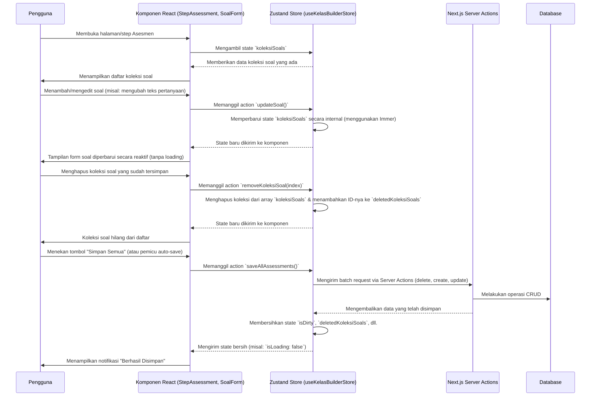

# Dokumentasi Modul Asesmen - Kelas Builder

Dokumen ini menjelaskan arsitektur dan alur data untuk modul Asesmen (`Assessment Step`) dalam fitur Kelas Builder.

## Ringkasan

Modul Asesmen memungkinkan guru untuk membuat, mengelola, dan mengatur "Koleksi Soal" yang berisi serangkaian pertanyaan untuk sebuah kelas. Arsitektur ini sangat berpusat pada *client-side state management* menggunakan **Zustand** untuk memberikan pengalaman pengguna yang cepat dan responsif, dengan data yang disinkronkan ke server secara strategis.

## Diagram Alur Data

## Arsitektur & Teknologi

1.  **State Management (Zustand)**:
    *   **Single Source of Truth**: Semua data terkait *class builder*, termasuk `koleksiSoals`, disimpan dalam satu *store* Zustand ([`useKelasBuilderStore`](lib/stores/kelas-builder/index.ts:32)).
    *   **Slices**: Logika untuk setiap bagian (Meta, Content, Assessment) dipisahkan menjadi *slices* (misalnya, [`assessment.ts`](lib/stores/kelas-builder/assessment.ts:42)) untuk keterbacaan dan pemeliharaan yang lebih baik.
    *   **Immer**: Digunakan sebagai *middleware* untuk memungkinkan pembaruan state yang kompleks dengan sintaks yang lebih sederhana dan *immutable* (contoh: `updateSoal`).

2.  **Komponen UI (React & Shadcn UI)**:
    *   [`StepAssessment.tsx`](components/kelas-builder/steps/step-assessment.tsx:15): Komponen utama yang menampilkan ringkasan dan daftar "Koleksi Soal". Bertanggung jawab untuk memicu dialog pembuatan/pengeditan koleksi dan *sheet* untuk manajemen soal.
    *   [`SoalForm.tsx`](components/kelas-builder/steps/soal-form.tsx:46): Form terperinci untuk satu soal. Menggunakan **React Hook Form** untuk validasi *real-time* dan manajemen *state* form lokal. Setiap perubahan pada form ini (misalnya, mengetik pertanyaan) secara langsung memanggil *action* Zustand (`updateSoal`) untuk menjaga agar *state* global selalu sinkron.

3.  **Interaksi Server (Next.js Server Actions)**:
    *   Semua komunikasi dengan *backend* dilakukan melalui Server Actions (misalnya, [`saveKoleksiSoalAction`](lib/stores/kelas-builder/assessment.ts:217)). Ini menyederhanakan arsitektur dengan menghilangkan kebutuhan untuk membuat *endpoint* API manual.
    *   Operasi penyimpanan dirancang untuk menjadi *atomic* di level entitas (misalnya, `saveSoal`, `saveKoleksiSoal`) dan juga mendukung operasi *batch* (`saveAllAssessments`).

## Alur Data Terperinci

### 1. Memuat Data (Loading)

*   Saat pengguna masuk ke mode edit, fungsi `loadDraft` di *store* utama ([`index.ts`](lib/stores/kelas-builder/index.ts:78)) dipanggil.
*   Fungsi ini mengambil seluruh data kelas dari server, termasuk `koleksiSoals` beserta semua `soals` dan `opsis`-nya.
*   Data ini kemudian di-*"hydrate"* ke dalam Zustand *store*, menjadi *state* awal untuk seluruh sesi *editing*.

### 2. Operasi CRUD (Create, Read, Update, Delete)

Operasi CRUD dilakukan dengan pendekatan **Optimistic UI** dan terjadi sepenuhnya di sisi klien terlebih dahulu.

*   **Create**:
    1.  Pengguna menekan "Create Collection" atau "Add Soal".
    2.  UI memanggil *action* Zustand (misalnya, `addKoleksiSoal`).
    3.  *Action* tersebut menambahkan objek baru ke dalam *array* `koleksiSoals` di *store*. Objek baru ini diberi `tempId` unik (misalnya, `temp-koleksi-12345`).
    4.  UI secara reaktif menampilkan koleksi/soal baru tersebut.

*   **Update**:
    1.  Pengguna mengedit sebuah form, misalnya mengubah judul soal di [`SoalForm`](components/kelas-builder/steps/soal-form.tsx:46).
    2.  `onChange` atau `onBlur` *event handler* pada *input field* memanggil *action* `updateSoal`.
    3.  *Action* ini menemukan soal yang sesuai di dalam *store* (menggunakan `koleksiIndex` dan `soalIndex`) dan memperbarui nilainya.
    4.  Tidak ada komunikasi dengan server pada tahap ini. *State* ditandai sebagai `isDirty`.

*   **Delete**:
    1.  Pengguna menekan tombol hapus.
    2.  UI memanggil `removeKoleksiSoal` atau `removeSoal`.
    3.  Logika di dalam *action* memeriksa apakah item yang dihapus memiliki `tempId` atau `id` asli.
        *   Jika `tempId` (belum pernah disimpan), item tersebut langsung dihapus dari *state* di *client*.
        *   Jika `id` asli (sudah ada di *database*), item dihapus dari *state* di *client*, tetapi `id`-nya ditambahkan ke *array* terpisah (misalnya, `deletedKoleksiSoals`).

### 3. Penyimpanan Data (Saving)

*   Penyimpanan dipicu oleh aksi pengguna (misalnya, tombol "Simpan") atau secara otomatis (*autosave*). Ini memanggil fungsi `saveAllAssessments`.
*   Fungsi ini melakukan serangkaian operasi secara berurutan:
    1.  **Menghapus Item**: Mengirim permintaan `DELETE` untuk setiap `id` yang ada di dalam *array* `deletedKoleksiSoals`, `deletedSoals`, dan `deletedOpsi`.
    2.  **Membuat & Memperbarui Item**: Melakukan iterasi pada `koleksiSoals` di *state*.
        *   Jika sebuah item memiliki `tempId`, ia akan mengirim permintaan `CREATE` ke server.
        *   Jika item tersebut ditandai sebagai `dirty` (diubah), ia akan mengirim permintaan `UPDATE`.
    3.  **Membersihkan State**: Setelah semua operasi server berhasil, *array* `deleted...` dikosongkan, `tempId` diganti dengan `id` asli dari server, dan *flag* `isDirty` diatur kembali ke `false`.

## Pro & Kontra

### 👍 Kelebihan (Pros)

1.  **Pengalaman Pengguna Superior**: UI sangat cepat dan responsif karena tidak ada *latency* jaringan untuk sebagian besar interaksi.
2.  **Mengurangi Beban Server**: Mencegah "banjir" permintaan API untuk setiap perubahan kecil. Server hanya dihubungi saat proses penyimpanan besar.
3.  **State yang Andal dan Dapat Diprediksi**: Penggunaan Zustand dengan Immer memastikan alur data yang jelas dan meminimalkan *bug* terkait sinkronisasi *state*.
4.  **Mendukung Operasi Offline/Draft**: Arsitektur ini secara inheren mendukung pekerjaan dalam mode *draft*. Jika diperluas dengan `localStorage`, ia bisa tahan terhadap penutupan *tab* yang tidak disengaja.

### 👎 Kekurangan (Cons)

1.  **Risiko Kehilangan Data**: Tanpa mekanisme *autosave* atau penyimpanan ke `localStorage`, semua perubahan yang belum disimpan akan hilang jika *browser* ditutup.
2.  **Kompleksitas Logika Sinkronisasi**: Logika di dalam `saveAllAssessments` cukup kompleks. Ia harus menangani kasus pembuatan, pembaruan, penghapusan, dan pengurutan dalam satu *batch*. Ini bisa menjadi sulit untuk di-debug.
3.  **Tidak untuk Kolaborasi Real-time**: Desain ini tidak cocok untuk skenario di mana beberapa pengguna mengedit kelas yang sama secara bersamaan.

## Rekomendasi Peningkatan

Berikut adalah beberapa saran untuk meningkatkan efisiensi kode, pemeliharaan, dan pengalaman pengguna.

### 1. Peningkatan Efisiensi Kode & Pemeliharaan

*   **Refaktor `saveAllAssessments`**: Fungsi `saveAllAssessments` saat ini sangat besar dan melakukan banyak hal (menghapus, menyimpan, mengurutkan). Ini dapat dipecah menjadi fungsi-fungsi yang lebih kecil dan lebih fokus (misalnya, `handleDeletions`, `handleUpserts`, `handleReordering`). Ini akan meningkatkan keterbacaan dan mempermudah pengujian.
*   **Debouncing pada `updateSoal`**: Di [`SoalForm.tsx`](components/kelas-builder/steps/soal-form.tsx:81), setiap ketikan pada editor teks memicu pembaruan ke *store* Zustand. Meskipun cepat, ini bisa menjadi berlebihan. Menerapkan *debouncing* pada *handler* `onUpdate` (misalnya, dengan jeda 300-500ms) akan mengurangi jumlah pembaruan *state* yang tidak perlu, terutama pada input teks yang panjang.
*   **Normalisasi State (Opsional, untuk Skala Besar)**: Saat ini, *state* berbentuk *nested* (`koleksiSoals` -> `soals` -> `opsis`). Untuk asesmen yang sangat besar, menormalisasi *state* (memisahkan `koleksiSoals`, `soals`, dan `opsis` menjadi entitas terpisah di dalam *store* dan mereferensikannya dengan ID) dapat menyederhanakan logika pembaruan dan mencegah *re-render* yang tidak perlu pada komponen induk saat anak diubah.

### 2. Peningkatan Pengalaman Pengguna (UX)

*   **Implementasi Auto-Save yang Andal**:
    *   **Pemicu**: Daripada hanya menyimpan saat pengguna menekan tombol, implementasikan *auto-save* yang dipicu oleh *flag* `isDirty`. Gunakan *hook* `useEffect` yang "mendengarkan" perubahan pada `isDirty` dan panggil `saveAllAssessments` setelah jeda waktu tertentu (misalnya, 5 detik setelah perubahan terakhir) menggunakan *debouncing*.
    *   **Indikator Status**: Tambahkan indikator visual yang jelas di UI untuk menunjukkan status penyimpanan:
        *   `Menyimpan...` (saat proses `isLoading`).
        *   `Semua perubahan disimpan` (saat `isDirty` adalah `false`).
        *   `Perubahan belum disimpan` (saat `isDirty` adalah `true`).
*   **Pencegahan Kehilangan Data dengan `localStorage`**:
    *   Gunakan *middleware* `persist` dari Zustand untuk secara otomatis menyimpan seluruh *state* `KelasBuilderStore` ke `localStorage`.
    *   Saat halaman dimuat, periksa apakah ada *state* di `localStorage`. Jika ada dan berbeda dari data yang akan dimuat dari server, tawarkan kepada pengguna pilihan: "Anda memiliki perubahan yang belum disimpan. Apakah Anda ingin melanjutkannya?". Ini memberikan jaring pengaman jika *browser* tidak sengaja tertutup.
*   **Manajemen Soal yang Lebih Baik**:
    *   **Drag-and-Drop untuk Mengurutkan Soal**: Di dalam `ManageQuestions`, implementasikan fungsionalitas *drag-and-drop* untuk mengubah urutan soal. Ini jauh lebih intuitif daripada menggunakan tombol panah atau input angka. Pustaka seperti `dnd-kit` atau `react-beautiful-dnd` dapat digunakan untuk ini.
    *   **Konfirmasi Penghapusan yang Lebih Aman**: Alih-alih menggunakan `confirm()` bawaan *browser*, gunakan komponen `AlertDialog` dari Shadcn UI untuk konfirmasi penghapusan. Ini memberikan pengalaman yang lebih konsisten dengan desain aplikasi dan memungkinkan pesan yang lebih deskriptif.
