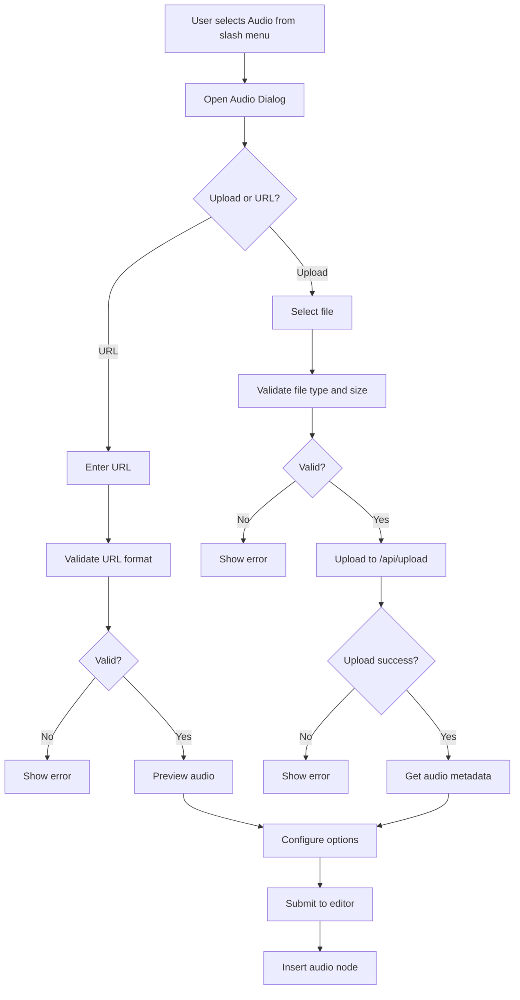

# Audio Node Design Document

## Overview

This document outlines the technical design for implementing an audio node functionality in the novel editor. The audio node will allow users to embed audio files either through file upload or external URL, with support for basic HTML5 audio controls.

## Requirements

- Support both file uploads and external URLs
- 20MB file size limit
- Basic HTML5 audio controls only
- Expanded player view by default
- Support for mp3, wav, ogg, m4a formats
- Autoplay and loop options
- Download functionality
- Visual feedback for loading/error states

## Component Architecture

```
┌─────────────────────────────────────────────────────────────┐
│                        Novel Editor                          │
├─────────────────────────────────────────────────────────────┤
│  ┌─────────────────┐  ┌─────────────────┐  ┌──────────────┐ │
│  │  Slash Command  │  │   Audio Dialog  │  │ Audio Node   │ │
│  │                 │  │                 │  │   View       │ │
│  │ - Add Audio     │  │ - File Upload   │  │ - HTML5      │ │
│  │   to menu       │  │ - URL Input     │  │   Player     │ │
│  │                 │  │ - Validation    │  │ - Metadata   │ │
│  └─────────────────┘  │ - Preview       │  │ - Controls   │ │
│                       │ - Options       │  │ - Download   │ │
│                       └─────────────────┘  └──────────────┘ │
│                                                             │
│  ┌─────────────────────────────────────────────────────────┐ │
│  │                Audio Extension                          │ │
│  │                                                         │ │
│  │ - Node.create() pattern                                │ │
│  │ - Attributes: src, filename, size, duration, autoplay, │ │
│  │   loop                                                  │ │
│  │ - parseHTML & renderHTML                               │ │
│  │ - Atom node (draggable, selectable)                   │ │
│  └─────────────────────────────────────────────────────────┘ │
└─────────────────────────────────────────────────────────────┘
```

## 1. Audio Extension Design

### File: `lib/editor/extensions/audio.ts`

```typescript
import { Node } from "@tiptap/core";
import { ReactNodeViewRenderer } from "@tiptap/react";
import { AudioNodeView } from "@/components/novel/AudioNodeView";

export interface AudioAttributes {
  src: string;
  filename?: string;
  size?: number;
  duration?: number;
  autoplay?: boolean;
  loop?: boolean;
}

export const AudioExtension = Node.create({
  name: "audio",
  group: "block",
  atom: true,
  draggable: true,
  selectable: true,

  addAttributes() {
    return {
      src: {
        default: null,
        parseHTML: element => {
          if (element && typeof element.getAttribute === 'function') {
            return element.getAttribute('data-src');
          }
          return null;
        },
      },
      filename: {
        default: null,
        parseHTML: element => {
          if (element && typeof element.getAttribute === 'function') {
            return element.getAttribute('data-filename');
          }
          return null;
        },
      },
      size: {
        default: null,
        parseHTML: element => {
          if (element && typeof element.getAttribute === 'function') {
            const size = element.getAttribute('data-size');
            return size ? parseInt(size, 10) : null;
          }
          return null;
        },
      },
      duration: {
        default: null,
        parseHTML: element => {
          if (element && typeof element.getAttribute === 'function') {
            const duration = element.getAttribute('data-duration');
            return duration ? parseFloat(duration) : null;
          }
          return null;
        },
      },
      autoplay: {
        default: false,
        parseHTML: element => {
          if (element && typeof element.getAttribute === 'function') {
            return element.getAttribute('data-autoplay') === 'true';
          }
          return false;
        },
      },
      loop: {
        default: false,
        parseHTML: element => {
          if (element && typeof element.getAttribute === 'function') {
            return element.getAttribute('data-loop') === 'true';
          }
          return false;
        },
      },
    };
  },

  parseHTML() {
    return [
      {
        tag: 'div[data-type="audio"]',
      },
    ];
  },

  renderHTML({ HTMLAttributes }) {
    const { src, filename, size, duration, autoplay, loop } = HTMLAttributes as AudioAttributes;
    
    function formatFileSize(bytes: number): string {
      if (bytes === 0) return "0 Bytes";
      const k = 1024;
      const sizes = ["Bytes", "KB", "MB", "GB"];
      const i = Math.floor(Math.log(bytes) / Math.log(k));
      return parseFloat((bytes / Math.pow(k, i)).toFixed(2)) + " " + sizes[i];
    }
    
    function formatDuration(seconds: number): string {
      if (!seconds || isNaN(seconds)) return "0:00";
      const mins = Math.floor(seconds / 60);
      const secs = Math.floor(seconds % 60);
      return `${mins}:${secs.toString().padStart(2, '0')}`;
    }
    
    return [
      'div',
      {
        'data-type': 'audio',
        'data-src': src,
        'data-filename': filename || '',
        'data-size': size || 0,
        'data-duration': duration || 0,
        'data-autoplay': autoplay || false,
        'data-loop': loop || false,
        class: 'audio-embed my-4',
      },
      [
        'div',
        { class: 'border rounded-lg overflow-hidden bg-card' },
        [
          'div',
          { class: 'bg-muted/50 px-4 py-3 border-b' },
          [
            'div',
            { class: 'flex items-center gap-2' },
            [
              'span',
              { class: 'text-2xl' },
              '🎵',
            ],
            [
              'div',
              {},
              [
                'p',
                { class: 'font-medium text-sm' },
                filename || 'Audio File',
              ],
              [
                'div',
                { class: 'flex items-center gap-2 text-xs text-muted-foreground' },
                size ? formatFileSize(size) : '',
                duration ? `• ${formatDuration(duration)}` : '',
              ].filter(Boolean),
            ],
          ],
        ],
        [
          'div',
          { class: 'p-4' },
          [
            'audio',
            {
              src: src,
              controls: 'true',
              autoplay: autoplay ? 'true' : undefined,
              loop: loop ? 'true' : undefined,
              class: 'w-full',
            },
            'Your browser does not support the audio element.',
          ],
        ],
      ],
    ];
  },

  addNodeView() {
    return ReactNodeViewRenderer(AudioNodeView);
  },
});

export default AudioExtension;
```

## 2. Audio Node View Component

### File: `components/novel/AudioNodeView.tsx`

```typescript
"use client";

import { NodeViewWrapper, type NodeViewProps } from "@tiptap/react";
import { useState, useRef, useEffect } from "react";
import { Music, Download, Play, Pause, Volume2 } from "lucide-react";
import { cn } from "@/lib/utils";

export const AudioNodeView = ({ node, selected }: NodeViewProps) => {
  const { src, filename, size, duration, autoplay, loop } = node.attrs;
  const [isPlaying, setIsPlaying] = useState(false);
  const [currentTime, setCurrentTime] = useState(0);
  const [audioDuration, setAudioDuration] = useState(duration || 0);
  const [isLoading, setIsLoading] = useState(true);
  const [error, setError] = useState<string | null>(null);
  const audioRef = useRef<HTMLAudioElement>(null);

  const formatFileSize = (bytes: number): string => {
    if (!bytes) return "";
    const k = 1024;
    const sizes = ["Bytes", "KB", "MB", "GB"];
    const i = Math.floor(Math.log(bytes) / Math.log(k));
    return parseFloat((bytes / Math.pow(k, i)).toFixed(2)) + " " + sizes[i];
  };

  const formatDuration = (seconds: number): string => {
    if (!seconds || isNaN(seconds)) return "0:00";
    const mins = Math.floor(seconds / 60);
    const secs = Math.floor(seconds % 60);
    return `${mins}:${secs.toString().padStart(2, '0')}`;
  };

  const handlePlayPause = () => {
    if (audioRef.current) {
      if (isPlaying) {
        audioRef.current.pause();
      } else {
        audioRef.current.play();
      }
      setIsPlaying(!isPlaying);
    }
  };

  const handleDownload = () => {
    const link = document.createElement("a");
    link.href = src;
    link.download = filename || "audio.mp3";
    document.body.appendChild(link);
    link.click();
    document.body.removeChild(link);
  };

  const handleTimeUpdate = () => {
    if (audioRef.current) {
      setCurrentTime(audioRef.current.currentTime);
    }
  };

  const handleLoadedMetadata = () => {
    if (audioRef.current) {
      setAudioDuration(audioRef.current.duration);
      setIsLoading(false);
    }
  };

  const handleError = () => {
    setError("Failed to load audio file");
    setIsLoading(false);
  };

  useEffect(() => {
    const audio = audioRef.current;
    if (audio) {
      audio.addEventListener('timeupdate', handleTimeUpdate);
      audio.addEventListener('loadedmetadata', handleLoadedMetadata);
      audio.addEventListener('error', handleError);
      
      return () => {
        audio.removeEventListener('timeupdate', handleTimeUpdate);
        audio.removeEventListener('loadedmetadata', handleLoadedMetadata);
        audio.removeEventListener('error', handleError);
      };
    }
  }, []);

  return (
    <NodeViewWrapper className={cn("my-4", selected && "ring-2 ring-primary ring-offset-2")}>
      <div className="border rounded-lg overflow-hidden bg-card">
        {/* Audio Header */}
        <div className="bg-muted/50 px-4 py-3 border-b flex items-center justify-between">
          <div className="flex items-center gap-2">
            <Music className="h-5 w-5 text-primary" />
            <div>
              <p className="font-medium text-sm">{filename || "Audio File"}</p>
              <div className="flex items-center gap-2 text-xs text-muted-foreground">
                {size && <span>{formatFileSize(size)}</span>}
                {audioDuration && <span>• {formatDuration(audioDuration)}</span>}
              </div>
            </div>
          </div>
          <div className="flex gap-2">
            <button
              onClick={handleDownload}
              className="flex items-center gap-1 px-3 py-1.5 text-sm font-medium rounded-md bg-secondary text-secondary-foreground hover:bg-secondary/80 transition-colors"
              title="Download Audio"
            >
              <Download className="h-4 w-4" />
              Download
            </button>
          </div>
        </div>
        
        {/* Audio Player */}
        <div className="p-4">
          {error ? (
            <div className="flex items-center gap-2 text-sm text-destructive p-4 bg-destructive/10 rounded-md">
              <Volume2 className="h-4 w-4" />
              {error}
            </div>
          ) : (
            <div className="space-y-3">
              {/* Custom Audio Controls */}
              <div className="flex items-center gap-3">
                <button
                  onClick={handlePlayPause}
                  disabled={isLoading}
                  className="flex items-center justify-center w-10 h-10 rounded-full bg-primary text-primary-foreground hover:bg-primary/90 disabled:opacity-50 disabled:cursor-not-allowed transition-colors"
                >
                  {isLoading ? (
                    <div className="w-4 h-4 border-2 border-primary-foreground border-t-transparent rounded-full animate-spin" />
                  ) : isPlaying ? (
                    <Pause className="h-4 w-4" />
                  ) : (
                    <Play className="h-4 w-4 ml-0.5" />
                  )}
                </button>
                
                {/* Progress Bar */}
                <div className="flex-1 flex items-center gap-2">
                  <span className="text-xs text-muted-foreground w-10 text-right">
                    {formatDuration(currentTime)}
                  </span>
                  <div className="flex-1 relative">
                    <div className="w-full h-2 bg-muted rounded-full overflow-hidden">
                      <div 
                        className="h-full bg-primary rounded-full transition-all duration-100"
                        style={{ width: `${audioDuration > 0 ? (currentTime / audioDuration) * 100 : 0}%` }}
                      />
                    </div>
                    <input
                      type="range"
                      min="0"
                      max={audioDuration || 0}
                      value={currentTime}
                      onChange={(e) => {
                        const newTime = parseFloat(e.target.value);
                        if (audioRef.current) {
                          audioRef.current.currentTime = newTime;
                          setCurrentTime(newTime);
                        }
                      }}
                      className="absolute inset-0 w-full opacity-0 cursor-pointer"
                    />
                  </div>
                  <span className="text-xs text-muted-foreground w-10">
                    {formatDuration(audioDuration)}
                  </span>
                </div>
              </div>
              
              {/* HTML5 Audio Element (hidden) */}
              <audio
                ref={audioRef}
                src={src}
                autoPlay={autoplay}
                loop={loop}
                preload="metadata"
                className="hidden"
              />
            </div>
          )}
        </div>
      </div>
    </NodeViewWrapper>
  );
};

export default AudioNodeView;
```

## 3. Audio Dialog Component

### File: `components/novel/audio-dialog.tsx`

```typescript
"use client";

import { useState, useRef } from "react";
import { Button } from "@/components/ui/button";
import {
  Dialog,
  DialogContent,
  DialogDescription,
  DialogFooter,
  DialogHeader,
  DialogTitle,
} from "@/components/ui/dialog";
import { Input } from "@/components/ui/input";
import { Label } from "@/components/ui/label";
import { Switch } from "@/components/ui/switch";
import { Tabs, TabsContent, TabsList, TabsTrigger } from "@/components/ui/tabs";
import { Music, Upload, Link } from "lucide-react";
import { toast } from "sonner";

interface AudioDialogProps {
  open: boolean;
  onOpenChange: (open: boolean) => void;
  onSubmit: (audioData: {
    src: string;
    filename?: string;
    size?: number;
    duration?: number;
    autoplay?: boolean;
    loop?: boolean;
  }) => void;
}

export function AudioDialog({ open, onOpenChange, onSubmit }: AudioDialogProps) {
  const [activeTab, setActiveTab] = useState("upload");
  const [url, setUrl] = useState("");
  const [file, setFile] = useState<File | null>(null);
  const [autoplay, setAutoplay] = useState(false);
  const [loop, setLoop] = useState(false);
  const [isUploading, setIsUploading] = useState(false);
  const [error, setError] = useState("");
  const [previewUrl, setPreviewUrl] = useState<string>("");
  const fileInputRef = useRef<HTMLInputElement>(null);
  const audioRef = useRef<HTMLAudioElement>(null);

  const supportedFormats = ["audio/mpeg", "audio/wav", "audio/ogg", "audio/mp4", "audio/m4a"];
  const maxFileSize = 20 * 1024 * 1024; // 20MB

  const validateFile = (file: File) => {
    if (!supportedFormats.includes(file.type)) {
      setError("Please select a valid audio file (MP3, WAV, OGG, M4A)");
      return false;
    }
    if (file.size > maxFileSize) {
      setError("File size too big (max 20MB)");
      return false;
    }
    return true;
  };

  const validateUrl = (url: string) => {
    try {
      const urlObj = new URL(url);
      const pathname = urlObj.pathname.toLowerCase();
      return pathname.endsWith('.mp3') || pathname.endsWith('.wav') || 
             pathname.endsWith('.ogg') || pathname.endsWith('.m4a');
    } catch {
      return false;
    }
  };

  const handleFileChange = (event: React.ChangeEvent<HTMLInputElement>) => {
    const selectedFile = event.target.files?.[0];
    if (selectedFile) {
      if (validateFile(selectedFile)) {
        setFile(selectedFile);
        setError("");
        // Create preview URL
        const url = URL.createObjectURL(selectedFile);
        setPreviewUrl(url);
      }
    }
  };

  const handleUrlChange = (value: string) => {
    setUrl(value);
    setError("");
    if (validateUrl(value)) {
      setPreviewUrl(value);
    } else {
      setPreviewUrl("");
    }
  };

  const handleUpload = async () => {
    if (!file) {
      setError("Please select a file");
      return;
    }

    setIsUploading(true);
    setError("");

    try {
      const formData = new FormData();
      formData.append("file", file);
      formData.append("type", "audio");
      formData.append("folder", "editor");

      const response = await fetch("/api/upload", {
        method: "POST",
        body: formData,
      });

      if (response.ok) {
        const result = await response.json();
        if (result.success && result.data?.url) {
          // Get duration if possible
          let duration = 0;
          if (audioRef.current) {
            audioRef.current.src = result.data.url;
            await new Promise(resolve => {
              audioRef.current!.onloadedmetadata = resolve;
            });
            duration = audioRef.current.duration || 0;
          }

          onSubmit({
            src: result.data.url,
            filename: file.name,
            size: file.size,
            duration,
            autoplay,
            loop,
          });

          // Reset form
          setFile(null);
          setPreviewUrl("");
          setAutoplay(false);
          setLoop(false);
          onOpenChange(false);
        } else {
          throw new Error(result.error || "Upload failed");
        }
      } else {
        const errorResult = await response.json().catch(() => ({}));
        throw new Error(errorResult.error || "Error uploading audio. Please try again.");
      }
    } catch (err) {
      setError(err instanceof Error ? err.message : "Upload failed");
    } finally {
      setIsUploading(false);
    }
  };

  const handleUrlSubmit = () => {
    if (!url.trim()) {
      setError("Please enter an audio URL");
      return;
    }

    if (!validateUrl(url)) {
      setError("Please enter a valid audio URL (MP3, WAV, OGG, M4A)");
      return;
    }

    // Get duration if possible
    let duration = 0;
    if (audioRef.current && previewUrl) {
      audioRef.current.src = previewUrl;
      audioRef.current.onloadedmetadata = () => {
        duration = audioRef.current?.duration || 0;
        onSubmit({
          src: url,
          filename: url.split('/').pop() || "Audio",
          duration,
          autoplay,
          loop,
        });
      };
    } else {
      onSubmit({
        src: url,
        filename: url.split('/').pop() || "Audio",
        autoplay,
        loop,
      });
    }

    // Reset form
    setUrl("");
    setPreviewUrl("");
    setAutoplay(false);
    setLoop(false);
    onOpenChange(false);
  };

  const handleSubmit = () => {
    if (activeTab === "upload") {
      handleUpload();
    } else {
      handleUrlSubmit();
    }
  };

  const handleTabChange = (value: string) => {
    setActiveTab(value);
    setError("");
    setPreviewUrl("");
  };

  return (
    <Dialog open={open} onOpenChange={onOpenChange}>
      <DialogContent className="sm:max-w-[500px]">
        <DialogHeader>
          <DialogTitle className="flex items-center gap-2">
            <Music className="h-5 w-5 text-primary" />
            Add Audio
          </DialogTitle>
          <DialogDescription>
            Upload an audio file or provide a URL to embed audio in your content.
          </DialogDescription>
        </DialogHeader>
        
        <Tabs value={activeTab} onValueChange={handleTabChange} className="w-full">
          <TabsList className="grid w-full grid-cols-2">
            <TabsTrigger value="upload" className="flex items-center gap-2">
              <Upload className="h-4 w-4" />
              Upload
            </TabsTrigger>
            <TabsTrigger value="url" className="flex items-center gap-2">
              <Link className="h-4 w-4" />
              URL
            </TabsTrigger>
          </TabsList>
          
          <TabsContent value="upload" className="space-y-4">
            <div className="space-y-2">
              <Label htmlFor="audio-file">Audio File</Label>
              <div
                onClick={() => fileInputRef.current?.click()}
                className="border-2 border-dashed border-muted-foreground/25 rounded-lg p-6 text-center cursor-pointer hover:border-muted-foreground/50 transition-colors"
              >
                {file ? (
                  <div className="space-y-2">
                    <Music className="h-8 w-8 mx-auto text-primary" />
                    <p className="text-sm font-medium">{file.name}</p>
                    <p className="text-xs text-muted-foreground">
                      {(file.size / 1024 / 1024).toFixed(2)} MB
                    </p>
                  </div>
                ) : (
                  <div className="space-y-2">
                    <Upload className="h-8 w-8 mx-auto text-muted-foreground" />
                    <p className="text-sm text-muted-foreground">
                      Click to upload or drag and drop
                    </p>
                    <p className="text-xs text-muted-foreground">
                      MP3, WAV, OGG, M4A (max 20MB)
                    </p>
                  </div>
                )}
                <input
                  ref={fileInputRef}
                  type="file"
                  accept="audio/*"
                  onChange={handleFileChange}
                  className="hidden"
                />
              </div>
            </div>
          </TabsContent>
          
          <TabsContent value="url" className="space-y-4">
            <div className="space-y-2">
              <Label htmlFor="audio-url">Audio URL</Label>
              <Input
                id="audio-url"
                placeholder="https://example.com/audio.mp3"
                value={url}
                onChange={(e) => handleUrlChange(e.target.value)}
                className={error ? "border-red-500" : ""}
              />
              {error && (
                <p className="text-sm text-red-500">{error}</p>
              )}
              <p className="text-xs text-muted-foreground">
                Direct link to MP3, WAV, OGG, or M4A file
              </p>
            </div>
          </TabsContent>
        </Tabs>

        {/* Preview */}
        {previewUrl && (
          <div className="space-y-2">
            <Label>Preview</Label>
            <audio
              ref={audioRef}
              src={previewUrl}
              controls
              className="w-full"
            />
          </div>
        )}

        {/* Options */}
        <div className="space-y-3">
          <div className="flex items-center justify-between">
            <Label htmlFor="autoplay">Autoplay</Label>
            <Switch
              id="autoplay"
              checked={autoplay}
              onCheckedChange={setAutoplay}
            />
          </div>
          <div className="flex items-center justify-between">
            <Label htmlFor="loop">Loop</Label>
            <Switch
              id="loop"
              checked={loop}
              onCheckedChange={setLoop}
            />
          </div>
        </div>

        {error && (
          <div className="text-sm text-red-500 bg-red-50 p-2 rounded">
            {error}
          </div>
        )}

        <DialogFooter>
          <Button
            variant="outline"
            onClick={() => onOpenChange(false)}
            disabled={isUploading}
          >
            Cancel
          </Button>
          <Button
            onClick={handleSubmit}
            disabled={isUploading || (!file && !url)}
          >
            {isUploading ? (
              <>
                <div className="w-4 h-4 border-2 border-white border-t-transparent rounded-full animate-spin mr-2" />
                Uploading...
              </>
            ) : (
              <>
                <Music className="h-4 w-4 mr-2" />
                Add Audio
              </>
            )}
          </Button>
        </DialogFooter>
      </DialogContent>
    </Dialog>
  );
}
```

## 4. Integration Points

### 4.1 Slash Command Integration

Add to `components/novel/slash-command.tsx`:

```typescript
{
  title: "Audio",
  description: "Upload or embed an audio file.",
  searchTerms: ["audio", "music", "sound", "mp3", "wav"],
  icon: <Music size={18} />,
  command: ({ editor, range }) => {
    editor.chain().focus().deleteRange(range).run();
    
    const event = new CustomEvent('openAudioDialog', {
      detail: { editor, range }
    });
    document.dispatchEvent(event);
  },
},
```

### 4.2 Extension Registration

Add to `components/novel/extensions.ts`:

```typescript
import { AudioExtension } from "@/lib/editor/extensions/audio";

// Add to defaultExtensions array:
AudioExtension,
```

### 4.3 Dialog Event Listener

Add to `components/novel/novel-editor.tsx`:

```typescript
import { AudioDialog } from "./audio-dialog";

// Add state:
const [openAudio, setOpenAudio] = useState(false);

// Add useEffect for event listener:
useEffect(() => {
  const handleOpenAudioDialog = (event: CustomEvent) => {
    setCurrentEditor(event.detail.editor);
    setOpenAudio(true);
  };

  document.addEventListener('openAudioDialog', handleOpenAudioDialog as EventListener);
  
  return () => {
    document.removeEventListener('openAudioDialog', handleOpenAudioDialog as EventListener);
  };
}, []);

// Add handler:
const handleAudioSubmit = (audioData: {
  src: string;
  filename?: string;
  size?: number;
  duration?: number;
  autoplay?: boolean;
  loop?: boolean;
}) => {
  if (currentEditor) {
    currentEditor.commands.insertContent({
      type: 'audio',
      attrs: audioData,
    });
  }
};

// Add dialog component:
<AudioDialog
  open={openAudio}
  onOpenChange={setOpenAudio}
  onSubmit={handleAudioSubmit}
/>
```

## 5. Data Flow

### Audio Upload Flow



### Audio Node Data Structure

```typescript
interface AudioNodeData {
  type: "audio";
  attrs: {
    src: string;           // Audio URL
    filename?: string;     // Original filename
    size?: number;         // File size in bytes
    duration?: number;     // Duration in seconds
    autoplay?: boolean;    // Autoplay setting
    loop?: boolean;        // Loop setting
  };
}
```

## 6. API Specifications

### Upload Endpoint: `/api/upload`

The existing upload endpoint should support audio files. Ensure it accepts:

- `file`: Audio file (multipart/form-data)
- `type`: "audio"
- `folder`: "editor"

Response format:
```typescript
{
  success: boolean;
  data?: {
    url: string;
    // Additional metadata if available
  };
  error?: string;
}
```

## 7. Error Handling Strategies

### Client-side Validation
- File type validation before upload
- File size validation (20MB limit)
- URL format validation
- Network error handling

### Server-side Validation
- Verify file type on server
- Enforce file size limits
- Handle upload failures gracefully

### User Feedback
- Toast notifications for upload status
- Inline error messages in dialog
- Loading states during operations
- Fallback UI for unsupported browsers

## 8. Accessibility Considerations

### Keyboard Navigation
- All interactive elements keyboard accessible
- Proper tab order in dialog
- Focus management when opening/closing dialog

### Screen Reader Support
- Semantic HTML structure
- ARIA labels for custom controls
- Audio element with proper controls
- Status announcements for upload progress

### Visual Accessibility
- Sufficient color contrast
- Clear focus indicators
- Text alternatives for icons
- Responsive design for various screen sizes

## 9. Styling Approach

### Consistency with Existing Nodes
- Use same border radius and spacing as PDF/YouTube nodes
- Match header styling with other media nodes
- Consistent button styles and hover states
- Same color scheme for icons and accents

### Responsive Design
- Full-width audio player on mobile
- Adaptive button layouts
- Touch-friendly controls
- Proper text sizing

### Visual States
- Loading states with spinners
- Error states with clear indicators
- Selected state with ring highlight
- Hover states for interactive elements

## 10. File Upload Validation Rules

### Allowed File Types
- `audio/mpeg` (MP3)
- `audio/wav` (WAV)
- `audio/ogg` (OGG)
- `audio/mp4` (M4A/MP4 Audio)
- `audio/x-m4a` (M4A alternative)

### File Size Limit
- Maximum: 20MB (20,971,520 bytes)
- User-friendly error message when exceeded

### URL Validation
- Must end with .mp3, .wav, .ogg, or .m4a
- Valid URL format required
- Direct link to audio file (not embed page)

### Additional Validation
- Check for actual audio content
- Verify file integrity
- Validate metadata extraction