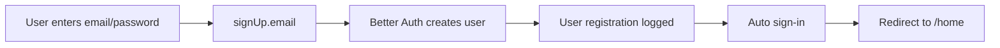
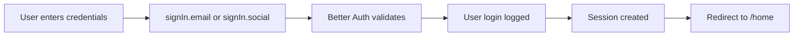

# Authentication & Authorization System

This document provides a comprehensive guide to the authentication and authorization system used in this application.

## Table of Contents

1. [Overview](#overview)
2. [Technology Stack](#technology-stack)
3. [Authentication Flow](#authentication-flow)
4. [User Roles & Permissions](#user-roles--permissions)
5. [Session Management](#session-management)
6. [Client-Side Authentication](#client-side-authentication)
7. [Server-Side Authentication](#server-side-authentication)
8. [Middleware Protection](#middleware-protection)
9. [Best Practices](#best-practices)

## Overview

The application uses **Better Auth** as the authentication framework, which provides a secure, flexible, and developer-friendly authentication system with support for:

- Email/Password authentication
- Google OAuth (Social login)
- Role-based access control (RBAC)
- Session management
- Automatic user fields (XP, level, streak tracking)

## Technology Stack

- **Better Auth**: Modern authentication library for Next.js
- **Prisma**: Database ORM with PostgreSQL adapter
- **Next.js**: Server and client-side rendering
- **Better Auth React**: Client-side authentication hooks

## Authentication Flow

### Sign Up Flow



### Sign In Flow



## User Roles & Permissions

The system supports three user roles:

| Role | Description | Default Redirect |
|------|-------------|-----------------|
| `MURID` | Student role (default) | `/home` |
| `GURU` | Teacher role | `/dashboard` |
| `ADMIN` | Administrator role | `/dashboard` |

### User Tiers

In addition to roles, users can have different access tiers:

- `FREE`: Basic access
- `PREMIUM`: Enhanced features
- `CUSTOM`: Full access with custom permissions

## Session Management

### Server-Side Session

Use these utilities in Server Components, API routes, and Server Actions:

```typescript
import { getServerSession, getServerUser, requireAuth } from "@/lib/session";

// Get session (returns null if not authenticated)
const session = await getServerSession();

// Get user directly
const user = await getServerUser();

// Require authentication (throws error if not authenticated)
const session = await requireAuth();
```

### Client-Side Session

Use the `useSession` hook in Client Components:

```typescript
"use client";
import { useSession } from "@/lib/auth-client";

export function MyComponent() {
  const { data: session, isPending } = useSession();
  
  if (isPending) return <div>Loading...</div>;
  if (!session) return <div>Not authenticated</div>;
  
  return <div>Welcome, {session.user.name}!</div>;
}
```

## Client-Side Authentication

### Available Functions

Import from [`lib/auth-client.ts`](../lib/auth-client.ts):

```typescript
import { 
  signIn, 
  signOut, 
  signUp,
  signInWithGoogle,
  signInWithEmailPassword,
  signUpWithEmailPassword,
  useSession,
  getSession
} from "@/lib/auth-client";
```

### Sign Up with Email/Password

```typescript
import { signUpWithEmailPassword } from "@/lib/auth-client";

const handleSignUp = async () => {
  try {
    const result = await signUpWithEmailPassword(
      "user@example.com",
      "securePassword123",
      "John Doe"
    );
    // User is automatically signed in and redirected
  } catch (error) {
    console.error("Sign up failed:", error);
  }
};
```

### Sign In with Email/Password

```typescript
import { signInWithEmailPassword } from "@/lib/auth-client";

const handleSignIn = async () => {
  try {
    const result = await signInWithEmailPassword(
      "user@example.com",
      "securePassword123"
    );
    // User is signed in and redirected to /home
  } catch (error) {
    console.error("Sign in failed:", error);
  }
};
```

### Sign In with Google

```typescript
import { signInWithGoogle } from "@/lib/auth-client";

const handleGoogleSignIn = async () => {
  try {
    await signInWithGoogle();
    // User is redirected to Google OAuth flow
  } catch (error) {
    console.error("Google sign in failed:", error);
  }
};
```

### Sign Out

```typescript
import { signOut } from "@/lib/auth-client";

const handleSignOut = async () => {
  try {
    await signOut();
    // User is signed out and redirected to /
  } catch (error) {
    console.error("Sign out failed:", error);
  }
};
```

### Get Session Client-Side

```typescript
import { getSession } from "@/lib/auth-client";

// In an async function or event handler
const session = await getSession();
if (session) {
  console.log("User:", session.user);
}
```

## Server-Side Authentication

### Session Utilities

Import from [`lib/session.ts`](../lib/session.ts):

#### Get Server Session

```typescript
import { getServerSession } from "@/lib/session";

export default async function MyServerComponent() {
  const session = await getServerSession();
  
  if (!session) {
    return <div>Please sign in</div>;
  }
  
  return <div>Welcome, {session.user.name}!</div>;
}
```

#### Get Current User

```typescript
import { getServerUser } from "@/lib/session";

export async function MyServerAction() {
  const user = await getServerUser();
  
  if (!user) {
    throw new Error("Not authenticated");
  }
  
  console.log("User ID:", user.id);
  console.log("User role:", user.role);
}
```

#### Require Authentication

```typescript
import { requireAuth } from "@/lib/session";

export async function protectedAction() {
  // Throws error if not authenticated
  const session = await requireAuth();
  
  // Continue with authenticated logic
  return { userId: session.user.id };
}
```

#### Check User Role

```typescript
import { hasRole } from "@/lib/session";

export async function MyServerComponent() {
  const isGuru = await hasRole("GURU");
  
  if (!isGuru) {
    return <div>Access denied: Teachers only</div>;
  }
  
  return <div>Teacher dashboard</div>;
}
```

#### Check User Plan

```typescript
import { hasPlan } from "@/lib/session";

export async function PremiumFeature() {
  const isPremium = await hasPlan("PREMIUM");
  
  if (!isPremium) {
    return <div>Upgrade to premium to access this feature</div>;
  }
  
  return <div>Premium content</div>;
}
```

## Middleware Protection

The application uses Next.js middleware to protect routes. Configuration in [`middleware.ts`](../middleware.ts):

### Route Types

1. **Public Routes**: Accessible without authentication
   - `/`, `/about`, `/contact`, `/pricing`, `/features`

2. **Auth Routes**: Sign in/up pages
   - `/auth`, `/auth/reset-password`, `/auth/verify-email`
   - Redirects to `/home` if already authenticated

3. **Protected Routes**: Require authentication
   - `/home`, `/dashboard`, `/profile`, `/settings`, `/kelas`, `/vocabulary`, `/soal`, `/game`
   - Redirects to `/auth` if not authenticated

### Middleware Behavior

```typescript
// If user tries to access protected route without auth
// → Redirect to /auth with callback URL

// If authenticated user tries to access /auth
// → Redirect to /home

// Role-based access is handled in route handlers, not middleware
```

## Best Practices

### 1. Always Validate on Server

Never trust client-side authentication alone. Always verify sessions on the server:

```typescript
// ❌ Bad: Only checking on client
"use client";
const { data: session } = useSession();
if (!session) return null;

// ✅ Good: Also verify on server
export async function ServerComponent() {
  const session = await getServerSession();
  if (!session) redirect("/auth");
  // ...
}
```

### 2. Use Appropriate Auth Method

- **Server Components**: Use [`getServerSession()`](../lib/session.ts:10)
- **Server Actions**: Use [`requireAuth()`](../lib/session.ts:35) or [`withAuth()`](../lib/auth-actions.ts:15)
- **Client Components**: Use [`useSession()`](../lib/auth-client.ts:12) hook
- **API Routes**: Use [`getServerSession()`](../lib/session.ts:10)

### 3. Handle Errors Gracefully

```typescript
try {
  const session = await requireAuth();
  // Protected logic
} catch (error) {
  // Handle authentication error
  return { error: "Authentication required" };
}
```

### 4. Leverage Role-Based Access

Use the provided wrappers for cleaner code:

```typescript
import { withRole } from "@/lib/auth-actions";

// Instead of manual role checking
export const createCourse = withRole("GURU", async (title: string) => {
  // Only GURU can execute this
  // ...
});
```

### 5. Use Type-Safe Sessions

```typescript
import type { Session } from "@/lib/auth";

function processSession(session: Session) {
  // TypeScript knows the session structure
  const userId = session.user.id;
  const role = session.user.role;
}
```

## Environment Variables

Required environment variables:

```env
# Better Auth
BETTER_AUTH_SECRET=your-secret-key
BETTER_AUTH_URL=http://localhost:3000
NEXT_PUBLIC_BETTER_AUTH_URL=http://localhost:3000

# Google OAuth (optional)
NEXT_PUBLIC_GOOGLE_CLIENT_ID=your-google-client-id
GOOGLE_CLIENT_SECRET=your-google-client-secret

# Database
DATABASE_URL=your-postgresql-connection-string
```

## User Schema

The user model includes these additional fields:

```typescript
{
  id: string;
  email: string;
  name: string;
  image?: string;
  role: "MURID" | "GURU" | "ADMIN";  // Default: "MURID"
  currentStreak: number;              // Default: 0
  xp: number;                         // Default: 0
  level: number;                      // Default: 1
  // ... other Better Auth fields
}
```

## Related Documentation

- [Server Actions Documentation](./server-actions.md) - Learn about protected server actions
- [API Routes Documentation](./api-routes.md) - API endpoint authentication
- [Routes Configuration](./routes.md) - Route protection patterns

## Support

For issues or questions about authentication:
1. Check Better Auth documentation: https://better-auth.com
2. Review the auth configuration in [`lib/auth.ts`](../lib/auth.ts)
3. Check middleware configuration in [`middleware.ts`](../middleware.ts)