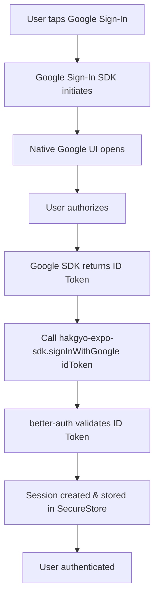
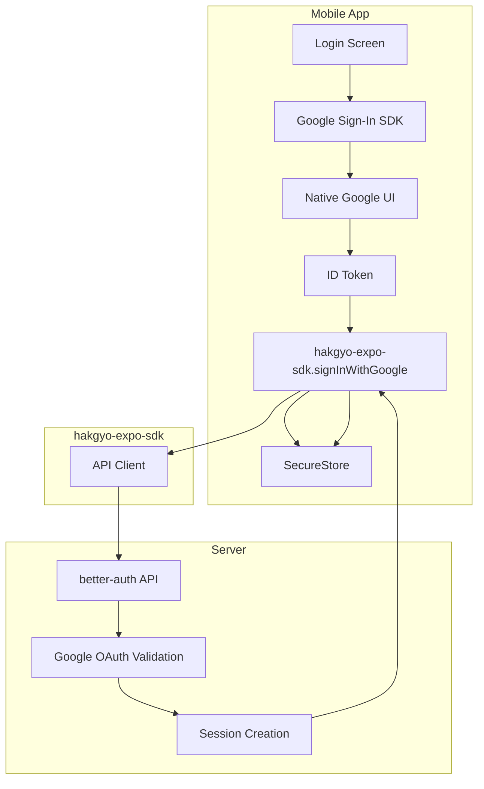

# Google OAuth Implementation Plan for Mobile App

## Overview

This document outlines the implementation plan for Google OAuth sign-in in the Hakgyo mobile app using the native Google Sign-In SDK approach.

## Current State

### Server-Side (Already Configured)
- ✅ Google OAuth configured in [`lib/auth.ts`](../lib/auth.ts:22-26)
- ✅ Trusted origins include `kli://` deep link scheme
- ✅ hakgyo-expo SDK has [`signInWithGoogle(idToken)`](../packages/hakgyo-expo-sdk/src/auth/client.ts:129-170) function

### Mobile App (Needs Implementation)
- ❌ Native Google Sign-In SDK not installed
- ❌ Google OAuth client IDs for mobile not created
- ❌ Deep link handling not configured
- ❌ Google Sign-In handler not implemented

## Implementation Flow



## Implementation Steps

### Step 1: Create Google OAuth Client IDs

**Action Required:** Mobile Team

1. Go to [Google Cloud Console](https://console.cloud.google.com/)
2. Select your project
3. Navigate to **APIs & Services** → **Credentials**
4. Create OAuth 2.0 Client IDs for:
   - **Android** (for Android app)
   - **iOS** (for iOS app)

#### Android Client ID
- Application type: Android
- Package name: Your mobile app's package name (e.g., `com.hakgyo.app`)
- SHA-256 fingerprint: Get from your signing certificate
  ```bash
  keytool -list -v -keystore ~/.android/debug.keystore -alias androiddebugkey -storepass android -keypass android
  ```

#### iOS Client ID
- Application type: iOS
- Bundle ID: Your app's bundle ID (e.g., `com.hakgyo.app`)
- Team ID: Your Apple Developer Team ID

#### Web Client ID (for server-side validation)
- Keep the existing web client ID from `.env.local`
- This is used by the server to validate the ID token

**Deliverables:**
- Android Client ID
- iOS Client ID
- Web Client ID (already exists)

### Step 2: Install Google Sign-In SDK

**Action Required:** Mobile Team

```bash
# Install the package
npx expo install @react-native-google-signin/google-signin

# For React Native CLI projects
npm install @react-native-google-signin/google-signin
npx pod-install  # iOS only
```

### Step 3: Configure Android

**Action Required:** Mobile Team

#### 3.1 Update `android/app/build.gradle`

```gradle
dependencies {
    implementation 'com.google.android.gms:play-services-auth:20.7.0'
}
```

#### 3.2 Update `android/app/src/main/AndroidManifest.xml`

Add deep link intent filter:

```xml
<activity
    android:name=".MainActivity"
    android:configChanges="keyboard|keyboardHidden|orientation|screenSize|uiMode"
    android:launchMode="singleTask"
    android:windowSoftInputMode="adjustResize">

    <!-- Existing intent filters -->

    <!-- Add deep link intent filter -->
    <intent-filter>
        <action android:name="android.intent.action.VIEW" />
        <category android:name="android.intent.category.DEFAULT" />
        <category android:name="android.intent.category.BROWSABLE" />
        <data android:scheme="kli" />
    </intent-filter>
</activity>
```

### Step 4: Configure iOS

**Action Required:** Mobile Team

#### 4.1 Update `ios/Podfile`

```ruby
pod 'GoogleSignIn', '~> 7.0'
```

Run:
```bash
cd ios && pod install && cd ..
```

#### 4.2 Update `ios/<your-app>/Info.plist`

Add deep link URL scheme:

```xml
<key>CFBundleURLTypes</key>
<array>
    <dict>
        <key>CFBundleURLSchemes</key>
        <array>
            <string>kli</string>
        </array>
    </dict>
</array>
```

#### 4.3 Add Google Sign-In to AppDelegate

```swift
// ios/<your-app>/AppDelegate.swift
import GoogleSignIn

func application(_ app: UIApplication, open url: URL, options: [UIApplication.OpenURLOptionsKey : Any] = [:]) -> Bool {
    return GIDSignIn.sharedInstance.handle(url)
}
```

### Step 5: Configure Environment Variables

**Action Required:** Mobile Team

Add to `.env` or `.env.local` in the mobile project:

```bash
# Google Client IDs (from Step 1)
EXPO_PUBLIC_GOOGLE_WEB_CLIENT_ID=your-web-client-id.apps.googleusercontent.com
EXPO_PUBLIC_GOOGLE_IOS_CLIENT_ID=your-ios-client-id.apps.googleusercontent.com
EXPO_PUBLIC_GOOGLE_ANDROID_CLIENT_ID=your-android-client-id.apps.googleusercontent.com

# Hakgyo API URL
EXPO_PUBLIC_HAKGYO_API_URL=https://hakgyo.vercel.app
```

### Step 6: Initialize Google Sign-In SDK

**Action Required:** Mobile Team

In your app entry point (e.g., `App.tsx` or `app/_layout.tsx`):

```typescript
import { GoogleSignin } from '@react-native-google-signin/google-signin';
import { Platform } from 'react-native';
import { useEffect } from 'react';

export default function App() {
  useEffect(() => {
    // Initialize Google Sign-In
    GoogleSignin.configure({
      webClientId: process.env.EXPO_PUBLIC_GOOGLE_WEB_CLIENT_ID,
      iosClientId: Platform.OS === 'ios' 
        ? process.env.EXPO_PUBLIC_GOOGLE_IOS_CLIENT_ID 
        : undefined,
      androidClientId: Platform.OS === 'android' 
        ? process.env.EXPO_PUBLIC_GOOGLE_ANDROID_CLIENT_ID 
        : undefined,
      offlineAccess: true,
    });
  }, []);

  return (
    // Your app content
  );
}
```

### Step 7: Initialize hakgyo-expo SDK

**Action Required:** Mobile Team

Ensure the SDK is initialized with the correct configuration:

```typescript
import { initSDK } from 'hakgyo-expo-sdk';

// Initialize SDK
initSDK({
  baseURL: process.env.EXPO_PUBLIC_HAKGYO_API_URL || 'https://hakgyo.vercel.app',
  auth: {
    deepLinkScheme: 'kli://',  // Must match your app's scheme
    storagePrefix: 'hakgyo_auth',
    sessionRefreshThreshold: 5,
    autoRefresh: true,
  },
  api: {
    timeout: 30000,
    retries: 3,
    retryDelay: 1000,
  },
});
```

### Step 8: Implement Google Sign-In Handler

**Action Required:** Mobile Team

Create a login screen component:

```typescript
import React from 'react';
import { View, Text, Button, Alert } from 'react-native';
import { GoogleSignin, statusCodes } from '@react-native-google-signin/google-signin';
import { useAuth } from 'hakgyo-expo-sdk';

function LoginScreen() {
  const { signInWithGoogle: sdkSignInWithGoogle, user, isLoading } = useAuth();

  const handleGoogleSignIn = async () => {
    try {
      // Check if device supports Google Play Services
      await GoogleSignin.hasPlayServices();
      
      // Sign in with Google
      const userInfo = await GoogleSignin.signIn();
      
      // Get the ID token
      const idToken = userInfo.idToken;
      
      if (!idToken) {
        throw new Error('No ID token received from Google');
      }
      
      // Call hakgyo-expo-sdk with the ID token
      const result = await sdkSignInWithGoogle(idToken);
      
      if (result.success) {
        // Navigate to authenticated screen
        router.replace('/dashboard');
      } else {
        Alert.alert('Error', result.error || 'Sign in failed');
      }
      
    } catch (error) {
      if (error.code === statusCodes.SIGN_IN_CANCELLED) {
        // User cancelled - do nothing
      } else if (error.code === statusCodes.IN_PROGRESS) {
        // Operation is already in progress
        Alert.alert('Info', 'Sign in is already in progress');
      } else if (error.code === statusCodes.PLAY_SERVICES_NOT_AVAILABLE) {
        Alert.alert('Error', 'Google Play Services not available');
      } else {
        Alert.alert('Error', 'Google sign in failed');
        console.error('Google sign in error:', error);
      }
    }
  };

  return (
    <View style={{ flex: 1, justifyContent: 'center', alignItems: 'center' }}>
      <Text>Login Screen</Text>
      <Button 
        title="Sign in with Google" 
        onPress={handleGoogleSignIn}
        disabled={isLoading}
      />
    </View>
  );
}

export default LoginScreen;
```

### Step 9: Wrap App with AuthProvider

**Action Required:** Mobile Team

```typescript
import { AuthProvider } from 'hakgyo-expo-sdk';
import LoginScreen from './screens/LoginScreen';
import DashboardScreen from './screens/DashboardScreen';

export default function App() {
  return (
    <AuthProvider>
      <AppNavigator />
    </AuthProvider>
  );
}

function AppNavigator() {
  const { user, isLoading } = useAuth();

  if (isLoading) {
    return <LoadingScreen />;
  }

  return user ? <DashboardScreen /> : <LoginScreen />;
}
```

### Step 10: Test the Implementation

**Action Required:** Mobile Team

#### Testing Checklist

- [ ] Run app on physical device (recommended) or emulator
- [ ] Tap the Google Sign-In button
- [ ] Verify native Google sign-in UI appears
- [ ] Complete authorization
- [ ] Verify session is created and stored
- [ ] Verify user can access authenticated screens
- [ ] Verify API calls work with the authenticated session
- [ ] Test sign-out functionality
- [ ] Test session persistence after app restart

#### Debug Logging

Enable debug logging for troubleshooting:

```typescript
import { initSDK } from 'hakgyo-expo-sdk';

initSDK({
  // ... other config
  logging: {
    enabled: true,
    level: 'debug',
  },
});
```

## Architecture Diagram



## Troubleshooting

### Common Issues

1. **Google Play Services Not Available**
   - Ensure you're testing on a physical device or emulator with Google Play Services
   - For Android emulators, use a Google Play System Image

2. **SHA-256 Mismatch**
   - Verify the SHA-256 fingerprint matches your signing certificate
   - For debug builds, use the debug keystore fingerprint
   - For release builds, use the release keystore fingerprint

3. **Deep Link Not Working**
   - Verify the scheme matches in both AndroidManifest.xml and Info.plist
   - Ensure the scheme is configured in hakgyo-expo SDK initialization
   - Test deep links using: `adb shell am start -W -a android.intent.action.VIEW -d "kli://test" com.your.package`

4. **ID Token Not Received**
   - Ensure offlineAccess is set to true in GoogleSignin.configure
   - Check that the correct client IDs are configured

## Dependencies

### Required Packages

```json
{
  "dependencies": {
    "@react-native-google-signin/google-signin": "^11.0.0",
    "hakgyo-expo-sdk": "^1.0.24",
    "expo-secure-store": "~12.8.1"
  }
}
```

## Security Considerations

1. **SHA-256 Fingerprint**: Always use the correct fingerprint for your build type (debug/release)
2. **Client IDs**: Never commit client IDs to public repositories
3. **ID Token Validation**: The server validates the ID token using the web client ID
4. **Secure Storage**: Sessions are stored using expo-secure-store

## Next Steps

1. Create Google OAuth client IDs in Google Cloud Console
2. Install and configure Google Sign-In SDK
3. Implement the sign-in handler
4. Test the complete flow
5. Handle edge cases and errors
6. Deploy to production

## References

- [Google Sign-In for React Native](https://github.com/react-native-google-signin/google-signin)
- [hakgyo-expo-sdk Documentation](../packages/hakgyo-expo-sdk/README.md)
- [better-auth Expo Plugin](https://www.better-auth.com/docs/plugins/expo)
- [Google Cloud Console](https://console.cloud.google.com/)
