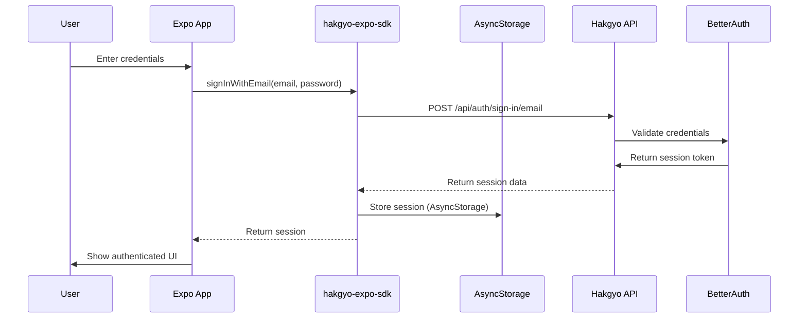
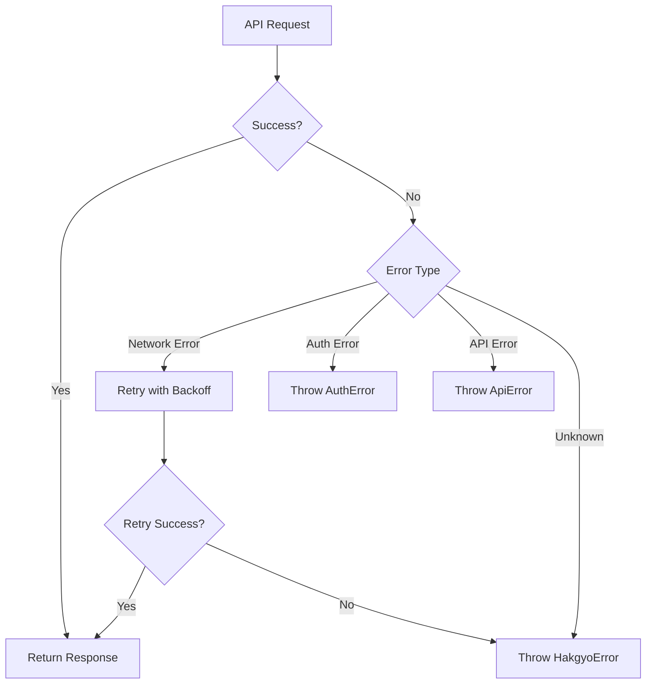

# hakgyo-expo-sdk Design Document

## Overview

The `hakgyo-expo-sdk` is a TypeScript SDK for Expo/React Native developers to integrate with the hakgyo webapp's authentication (BetterAuth) and API routes. It provides full type safety, session management with AsyncStorage, and a clean API for interacting with hakgyo's backend services.

**Version**: 1.0.0
**Target Framework**: Expo SDK 50+ / React Native
**TypeScript Version**: 5.0+

---

## Table of Contents

1. [Package Structure](#package-structure)
2. [Module Exports](#module-exports)
3. [Configuration Interface](#configuration-interface)
4. [Type Definitions](#type-definitions)
5. [API Client Design](#api-client-design)
6. [Authentication Flow](#authentication-flow)
7. [Session Management](#session-management)
8. [Error Handling](#error-handling)
9. [Example Usage](#example-usage)

---

## Package Structure

```
hakgyo-expo-sdk/
├── package.json
├── tsconfig.json
├── README.md
├── LICENSE
├── src/
│   ├── index.ts                 # Main entry point
│   ├── config/
│   │   ├── index.ts             # Configuration types and defaults
│   │   └── validation.ts        # Configuration validation schemas
│   ├── types/
│   │   ├── index.ts             # All exported types
│   │   ├── auth.ts              # Auth-related types
│   │   ├── api.ts               # API response types
│   │   ├── models.ts            # Domain models (User, Session, etc.)
│   │   └── errors.ts            # Error types
│   ├── auth/
│   │   ├── index.ts             # Auth module exports
│   │   ├── client.ts            # BetterAuth client wrapper
│   │   ├── session.ts           # Session management
│   │   ├── providers.ts         # Auth provider hooks
│   │   └── storage.ts           # AsyncStorage adapter
│   ├── api/
│   │   ├── index.ts             # API module exports
│   │   ├── client.ts            # Base API client
│   │   ├── endpoints.ts         # Endpoint definitions
│   │   └── modules/             # API resource modules
│   │       ├── kelas.ts         # Class/Course API
│   │       ├── materi.ts        # Material API
│   │       ├── vocabulary.ts    # Vocabulary API
│   │       ├── soal.ts          # Questions API
│   │       ├── tryout.ts        # Tryout/Exam API
│   │       ├── posts.ts         # Social Posts API
│   │       ├── user.ts          # User API
│   │       └── notifications.ts  # Push notifications API
│   ├── utils/
│   │   ├── index.ts             # Utility exports
│   │   ├── logger.ts            # Logging utility
│   │   ├── retry.ts             # Retry logic
│   │   └── validators.ts        # Input validators
│   └── errors/
│       ├── index.ts             # Error exports
│       ├── HakgyoError.ts       # Base error class
│       ├── AuthError.ts         # Auth-specific errors
│       ├── ApiError.ts          # API-specific errors
│       └── NetworkError.ts      # Network-related errors
├── examples/
│   ├── basic-auth.tsx           # Basic authentication example
│   ├── protected-route.tsx      # Protected route example
│   └── api-usage.tsx            # API usage examples
└── tests/
    ├── auth/
    ├── api/
    └── utils/
```

### Directory Purposes

| Directory | Purpose |
|-----------|---------|
| `src/config/` | Configuration management, validation, and defaults |
| `src/types/` | All TypeScript type definitions and interfaces |
| `src/auth/` | Authentication client, session management, storage adapter |
| `src/api/` | API client, endpoint definitions, resource modules |
| `src/utils/` | Shared utilities (logging, retry, validation) |
| `src/errors/` | Custom error classes for different error scenarios |
| `examples/` | Code examples for SDK users |
| `tests/` | Unit and integration tests |

---

## Module Exports

### Main Entry Point (`src/index.ts`)

```typescript
// Configuration
export { HakgyoSDK, type HakgyoSDKConfig } from './config';
export { initSDK } from './config';

// Types
export * from './types';

// Auth
export * from './auth';

// API
export * from './api';

// Utils
export * from './utils';

// Errors
export * from './errors';
```

### Configuration Module (`src/config/`)

**Exports:**
- `HakgyoSDKConfig` - Configuration interface
- `initSDK(config: HakgyoSDKConfig)` - SDK initialization function
- `validateConfig(config: HakgyoSDKConfig)` - Configuration validator
- `DEFAULT_CONFIG` - Default configuration values

**Purpose:** Initialize and validate SDK configuration, manage global SDK instance.

### Types Module (`src/types/`)

**Exports:**
- `User`, `Session`, `UserRole`, `UserTier` - Core auth types
- `Kelas`, `Materi`, `VocabularySet`, `Soal`, `Tryout` - Domain models
- `ApiResponse<T>` - Generic API response wrapper
- `PaginatedResponse<T>` - Paginated response type
- `AuthError`, `ApiError`, `NetworkError` - Error types

**Purpose:** Provide type-safe interfaces for all SDK operations.

### Auth Module (`src/auth/`)

**Exports:**
- `useSession()` - React hook for accessing session
- `useAuth()` - React hook for auth operations
- `signInWithEmail(email, password)` - Email/password sign in
- `signUpWithEmail(email, password, name)` - Email/password sign up
- `signInWithGoogle()` - Google OAuth sign in
- `signOut()` - Sign out current user
- `getSession()` - Get current session (async)
- `refreshSession()` - Refresh current session
- `AuthProvider` - React Context Provider
- `SessionManager` - Session management class

**Purpose:** Handle all authentication operations and session management.

### API Module (`src/api/`)

**Exports:**
- `apiClient` - Configured API client instance
- `kelasApi` - Class/Course API methods
- `materiApi` - Material API methods
- `vocabularyApi` - Vocabulary API methods
- `soalApi` - Questions API methods
- `tryoutApi` - Tryout/Exam API methods
- `postsApi` - Social Posts API methods
- `userApi` - User API methods
- `notificationsApi` - Push notifications API methods

**Purpose:** Provide type-safe methods for all API endpoints.

### Utils Module (`src/utils/`)

**Exports:**
- `logger` - Logging utility
- `retry(fn, options)` - Retry logic with exponential backoff
- `validateEmail(email)` - Email validator
- `validatePassword(password)` - Password validator

**Purpose:** Shared utility functions used across the SDK.

### Errors Module (`src/errors/`)

**Exports:**
- `HakgyoError` - Base error class
- `AuthError` - Authentication errors
- `ApiError` - API response errors
- `NetworkError` - Network-related errors
- `isHakgyoError(error)` - Type guard for SDK errors

**Purpose:** Provide structured error handling with type safety.

---

## Configuration Interface

### HakgyoSDKConfig

```typescript
interface HakgyoSDKConfig {
  // Required
  baseURL: string;              // Base URL of hakgyo API (e.g., "https://hakgyo.vercel.app")
  
  // Optional - Auth Configuration
  auth?: {
    storagePrefix?: string;      // AsyncStorage key prefix (default: "hakgyo_auth")
    sessionRefreshThreshold?: number; // Minutes before expiry to refresh (default: 5)
    autoRefresh?: boolean;       // Auto-refresh sessions (default: true)
    deepLinkScheme?: string;     // Deep link scheme (default: "kli://")
  };
  
  // Optional - API Configuration
  api?: {
    timeout?: number;            // Request timeout in ms (default: 30000)
    retries?: number;            // Number of retries (default: 3)
    retryDelay?: number;         // Base retry delay in ms (default: 1000)
  };
  
  // Optional - Logging
  logging?: {
    enabled?: boolean;           // Enable logging (default: false in production)
    level?: 'debug' | 'info' | 'warn' | 'error'; // Log level (default: 'error')
  };
  
  // Optional - Platform-specific
  platform?: {
    deviceId?: string;           // Device identifier for push tokens
    platformType?: 'ios' | 'android' | 'web';
  };
}
```

### Configuration Example

```typescript
import { initSDK } from 'hakgyo-expo-sdk';

// Initialize SDK with configuration
const sdk = initSDK({
  baseURL: 'https://hakgyo.vercel.app',
  auth: {
    storagePrefix: 'myapp_auth',
    sessionRefreshThreshold: 10,
    autoRefresh: true,
    deepLinkScheme: 'myapp://',
  },
  api: {
    timeout: 30000,
    retries: 3,
  },
  logging: {
    enabled: __DEV__,
    level: 'debug',
  },
});
```

---

## Type Definitions

### Core Types (`src/types/auth.ts`)

```typescript
// User Role Enum
export type UserRole = 'MURID' | 'GURU' | 'ADMIN';

// User Tier/Access Level Enum
export type UserTier = 'FREE' | 'PREMIUM' | 'CUSTOM';

// User Interface
export interface User {
  id: string;
  email: string;
  name?: string;
  role: UserRole;
  currentStreak: number;
  xp: number;
  level: number;
  image?: string;
  bio?: string;
  emailVerified: boolean;
  createdAt: string;
  updatedAt: string;
  lastActive?: string;
  // Computed/derived fields (not from API)
  accessTier?: UserTier;
}

// Session Interface
export interface Session {
  user: User;
  token: string;
  expiresAt: string;
  createdAt: string;
}

// Auth Response Types
export interface SignInResponse {
  success: boolean;
  session?: Session;
  error?: string;
}

export interface SignUpResponse {
  success: boolean;
  session?: Session;
  error?: string;
}

export interface SignOutResponse {
  success: boolean;
  error?: string;
}
```

### Domain Models (`src/types/models.ts`)

```typescript
// Kelas (Class/Course) Types
export interface Kelas {
  id: number;
  title: string;
  description?: string;
  jsonDescription?: any;
  htmlDescription?: string;
  type: 'REGULAR' | 'EVENT' | 'GROUP' | 'PRIVATE' | 'FUN';
  level: 'BEGINNER' | 'INTERMEDIATE' | 'ADVANCED';
  thumbnail?: string;
  icon?: string;
  isPaidClass: boolean;
  price?: string;
  discount?: string;
  promoCode?: string;
  isDraft: boolean;
  authorId: string;
  author?: User;
  createdAt: string;
  updatedAt: string;
}

// Materi (Material) Types
export interface Materi {
  id: number;
  title: string;
  description: string;
  jsonDescription: any;
  htmlDescription: string;
  order: number;
  isDemo: boolean;
  isDraft: boolean;
  koleksiSoalId?: number;
  passingScore?: number;
  kelasId: number;
  kelas?: Kelas;
  createdAt: string;
  updatedAt: string;
}

// Vocabulary Types
export interface VocabularySet {
  id: number;
  title: string;
  description?: string;
  icon?: string;
  isPublic: boolean;
  isDraft: boolean;
  userId?: string;
  kelasId?: number;
  createdAt: string;
  updatedAt: string;
}

export interface VocabularyItem {
  id: number;
  korean: string;
  indonesian: string;
  isLearned: boolean;
  type: 'WORD' | 'SENTENCE' | 'IDIOM';
  pos?: 'KATA_KERJA' | 'KATA_BENDA' | 'KATA_SIFAT' | 'KATA_KETERANGAN';
  audioUrl?: string;
  exampleSentences: string[];
  order: number;
  creatorId: string;
  collectionId?: number;
  createdAt: string;
  updatedAt: string;
}

// Soal (Question) Types
export interface Soal {
  id: number;
  koleksiSoalId: number;
  authorId: string;
  pertanyaan: string;
  difficulty?: 'BEGINNER' | 'INTERMEDIATE' | 'ADVANCED';
  explanation?: string;
  isActive: boolean;
  order?: number;
  createdAt: string;
  updatedAt: string;
  opsis: Opsi[];
  attachments: SoalAttachment[];
}

export interface Opsi {
  id: number;
  soalId: number;
  opsiText: string;
  isCorrect: boolean;
  order: number;
  createdAt: string;
  updatedAt: string;
  attachments: OpsiAttachment[];
}

export interface SoalAttachment {
  id: number;
  soalId: number;
  url: string;
  type: string;
  filename?: string;
  size?: number;
  mimeType?: string;
  order: number;
  createdAt: string;
  updatedAt: string;
}

// Tryout Types
export interface Tryout {
  id: number;
  nama: string;
  startTime: string;
  endTime: string;
  duration: number;
  koleksiSoalId: number;
  isActive: boolean;
  guruId: string;
  createdAt: string;
  updatedAt: string;
}

// Post Types
export interface Post {
  id: number;
  title: string;
  description?: string;
  jsonDescription?: any;
  htmlDescription: string;
  type: 'DISCUSSION' | 'ANNOUNCEMENT' | 'QUESTION' | 'SHARE' | 'TUTORIAL';
  isPublished: boolean;
  isPinned: boolean;
  viewCount: number;
  likeCount: number;
  commentCount: number;
  shareCount: number;
  tags: string[];
  createdAt: string;
  updatedAt: string;
  authorId: string;
  author?: User;
  kelasId?: number;
}

// Live Session Types
export interface LiveSession {
  id: string;
  name: string;
  description?: string;
  streamCallId?: string;
  status: 'SCHEDULED' | 'LIVE' | 'ENDED';
  scheduledStart: string;
  scheduledEnd?: string;
  actualStart?: string;
  actualEnd?: string;
  recordingUrl?: string;
  createdAt: string;
  updatedAt: string;
  creatorId: string;
  kelasId: number;
}
```

### API Response Types (`src/types/api.ts`)

```typescript
// Generic API Response
export interface ApiResponse<T = any> {
  success: boolean;
  data?: T;
  error?: string;
  message?: string;
}

// Paginated Response
export interface PaginatedResponse<T> extends ApiResponse<T[]> {
  pagination: {
    page: number;
    limit: number;
    total: number;
    totalPages: number;
  };
}

// Query Parameters
export interface QueryParams {
  page?: number;
  limit?: number;
  sortBy?: string;
  sortOrder?: 'asc' | 'desc';
  search?: string;
  [key: string]: any;
}
```

### Error Types (`src/types/errors.ts`)

```typescript
// Base Error Class
export class HakgyoError extends Error {
  code: string;
  statusCode: number;
  details?: any;

  constructor(message: string, code: string, statusCode: number = 500, details?: any) {
    super(message);
    this.name = 'HakgyoError';
    this.code = code;
    this.statusCode = statusCode;
    this.details = details;
  }
}

// Auth Error
export class AuthError extends HakgyoError {
  constructor(message: string, code: string, details?: any) {
    super(message, code, 401, details);
    this.name = 'AuthError';
  }
}

// API Error
export class ApiError extends HakgyoError {
  constructor(message: string, code: string, statusCode: number, details?: any) {
    super(message, code, statusCode, details);
    this.name = 'ApiError';
  }
}

// Network Error
export class NetworkError extends HakgyoError {
  constructor(message: string, details?: any) {
    super(message, 'NETWORK_ERROR', 0, details);
    this.name = 'NetworkError';
  }
}

// Error Codes
export const ErrorCodes = {
  // Auth Errors
  UNAUTHORIZED: 'UNAUTHORIZED',
  INVALID_CREDENTIALS: 'INVALID_CREDENTIALS',
  SESSION_EXPIRED: 'SESSION_EXPIRED',
  TOKEN_REFRESH_FAILED: 'TOKEN_REFRESH_FAILED',
  
  // API Errors
  NOT_FOUND: 'NOT_FOUND',
  FORBIDDEN: 'FORBIDDEN',
  VALIDATION_ERROR: 'VALIDATION_ERROR',
  RATE_LIMIT_EXCEEDED: 'RATE_LIMIT_EXCEEDED',
  
  // Network Errors
  NETWORK_ERROR: 'NETWORK_ERROR',
  TIMEOUT: 'TIMEOUT',
  OFFLINE: 'OFFLINE',
} as const;

// Type Guard
export function isHakgyoError(error: unknown): error is HakgyoError {
  return error instanceof HakgyoError;
}
```

---

## API Client Design

### Base API Client (`src/api/client.ts`)

The API client is built on top of `fetch` with the following features:
- Automatic token injection from session
- Request/response interceptors
- Retry logic with exponential backoff
- Type-safe request/response handling
- Error handling and transformation

```typescript
class ApiClient {
  private baseURL: string;
  private config: ApiClientConfig;
  private sessionManager: SessionManager;

  constructor(baseURL: string, config: ApiClientConfig, sessionManager: SessionManager) {
    this.baseURL = baseURL;
    this.config = config;
    this.sessionManager = sessionManager;
  }

  async request<T>(
    method: string,
    path: string,
    options?: RequestOptions
  ): Promise<ApiResponse<T>> {
    // Implementation details...
  }

  get<T>(path: string, params?: QueryParams): Promise<ApiResponse<T>> { }
  post<T>(path: string, body?: any): Promise<ApiResponse<T>> { }
  put<T>(path: string, body?: any): Promise<ApiResponse<T>> { }
  patch<T>(path: string, body?: any): Promise<ApiResponse<T>> { }
  delete<T>(path: string): Promise<ApiResponse<T>> { }
}
```

### API Modules Structure

Each API module provides methods for a specific resource:

```typescript
// src/api/modules/kelas.ts
export const kelasApi = {
  // Get all classes (paginated)
  list: (params?: QueryParams) => Promise<ApiResponse<Kelas[]>>,
  
  // Get class by ID
  get: (id: number) => Promise<ApiResponse<Kelas>>,
  
  // Create new class (GURU/ADMIN only)
  create: (data: CreateKelasDto) => Promise<ApiResponse<Kelas>>,
  
  // Update class
  update: (id: number, data: UpdateKelasDto) => Promise<ApiResponse<Kelas>>,
  
  // Delete class
  delete: (id: number) => Promise<ApiResponse<void>>,
  
  // Join a class
  join: (id: number) => Promise<ApiResponse<void>>,
  
  // Leave a class
  leave: (id: number) => Promise<ApiResponse<void>>,
  
  // Get class materials
  getMaterials: (kelasId: number) => Promise<ApiResponse<Materi[]>>,
};

// src/api/modules/materi.ts
export const materiApi = {
  // Get material by ID
  get: (id: number) => Promise<ApiResponse<Materi>>,
  
  // Complete material
  complete: (id: number) => Promise<ApiResponse<void>>,
  
  // Submit assessment
  submitAssessment: (materiId: number, answers: any[]) => Promise<ApiResponse<AssessmentResult>>,
};

// src/api/modules/vocabulary.ts
export const vocabularyApi = {
  // Get daily vocabulary
  getDaily: () => Promise<ApiResponse<VocabularyItem>>,
  
  // Get vocabulary set
  getSet: (id: number) => Promise<ApiResponse<VocabularySet>>,
  
  // Get vocabulary sets (paginated)
  listSets: (params?: QueryParams) => Promise<ApiResponse<VocabularySet[]>>,
  
  // Create vocabulary set
  createSet: (data: CreateVocabularySetDto) => Promise<ApiResponse<VocabularySet>>,
  
  // Add item to set
  addItem: (setId: number, data: CreateVocabularyItemDto) => Promise<ApiResponse<VocabularyItem>>,
  
  // Mark item as learned
  markLearned: (itemId: number) => Promise<ApiResponse<void>>,
};

// src/api/modules/soal.ts
export const soalApi = {
  // Get question collection
  getCollection: (id: number) => Promise<ApiResponse<KoleksiSoal>>,
  
  // Get question collections (paginated)
  listCollections: (params?: QueryParams) => Promise<ApiResponse<KoleksiSoal[]>>,
  
  // Create question collection
  createCollection: (data: CreateKoleksiSoalDto) => Promise<ApiResponse<KoleksiSoal>>,
  
  // Practice questions
  practice: (collectionId: number) => Promise<ApiResponse<PracticeSession>>,
  
  // Submit practice answers
  submitPractice: (sessionId: string, answers: any[]) => Promise<ApiResponse<PracticeResult>>,
};

// src/api/modules/tryout.ts
export const tryoutApi = {
  // Get tryout by ID
  get: (id: number) => Promise<ApiResponse<Tryout>>,
  
  // Get active tryouts
  listActive: () => Promise<ApiResponse<Tryout[]>>,
  
  // Participate in tryout
  participate: (id: number) => Promise<ApiResponse<TryoutParticipant>>,
  
  // Submit tryout
  submit: (tryoutId: number, answers: any[]) => Promise<ApiResponse<TryoutResult>>,
  
  // Get tryout results
  getResults: (tryoutId: number) => Promise<ApiResponse<TryoutResult>>,
};

// src/api/modules/posts.ts
export const postsApi = {
  // Get posts (paginated)
  list: (params?: QueryParams) => Promise<ApiResponse<Post[]>>,
  
  // Get post by ID
  get: (id: number) => Promise<ApiResponse<Post>>,
  
  // Create post
  create: (data: CreatePostDto) => Promise<ApiResponse<Post>>,
  
  // Update post
  update: (id: number, data: UpdatePostDto) => Promise<ApiResponse<Post>>,
  
  // Delete post
  delete: (id: number) => Promise<ApiResponse<void>>,
  
  // Like post
  like: (id: number) => Promise<ApiResponse<void>>,
  
  // Unlike post
  unlike: (id: number) => Promise<ApiResponse<void>>,
  
  // Get post comments
  getComments: (postId: number) => Promise<ApiResponse<Comment[]>>,
  
  // Add comment
  addComment: (postId: number, content: string) => Promise<ApiResponse<Comment>>,
};

// src/api/modules/user.ts
export const userApi = {
  // Get current user profile
  getProfile: () => Promise<ApiResponse<User>>,
  
  // Update profile
  updateProfile: (data: UpdateUserDto) => Promise<ApiResponse<User>>,
  
  // Get user's classes
  getClasses: (userId?: string) => Promise<ApiResponse<Kelas[]>>,
  
  // Get user's tryout results
  getTryoutResults: (userId?: string) => Promise<ApiResponse<TryoutResult[]>>,
  
  // Register push token
  registerPushToken: (token: string) => Promise<ApiResponse<void>>,
};

// src/api/modules/notifications.ts
export const notificationsApi = {
  // Register push token
  registerToken: (token: string, deviceId?: string) => Promise<ApiResponse<void>>,
  
  // Unregister push token
  unregisterToken: (tokenId: string) => Promise<ApiResponse<void>>,
};
```

### Endpoint Definitions (`src/api/endpoints.ts`)

```typescript
export const API_ENDPOINTS = {
  // Auth Endpoints
  AUTH: {
    SIGN_UP_EMAIL: '/api/auth/sign-up/email',
    SIGN_IN_EMAIL: '/api/auth/sign-in/email',
    SIGN_IN_SOCIAL: '/api/auth/sign-in/social',
    SIGN_OUT: '/api/auth/sign-out',
    GET_SESSION: '/api/auth/get-session',
    SESSION: '/api/auth/session',
    USER: '/api/auth/user',
  },
  
  // Kelas Endpoints
  KELAS: {
    LIST: '/api/kelas',
    GET: (id: number) => `/api/kelas/${id}`,
    CREATE: '/api/kelas',
    UPDATE: (id: number) => `/api/kelas/${id}`,
    DELETE: (id: number) => `/api/kelas/${id}`,
    JOIN: (id: number) => `/api/kelas/${id}/join`,
    LEAVE: (id: number) => `/api/kelas/${id}/leave`,
    MATERIALS: (id: number) => `/api/kelas/${id}/materi`,
  },
  
  // Materi Endpoints
  MATERI: {
    GET: (id: number) => `/api/materi/${id}`,
    COMPLETE: (id: number) => `/api/materi/${id}/complete`,
    ASSESSMENT: (id: number) => `/api/materi/${id}/assessment`,
    ASSESSMENT_CONFIG: (id: number) => `/api/materi/${id}/assessment-config`,
  },
  
  // Vocabulary Endpoints
  VOCABULARY: {
    DAILY: '/api/vocabulary/daily',
    SETS: '/api/vocabulary-sets',
    SET_GET: (id: number) => `/api/vocabulary-sets/${id}`,
    ITEMS: '/api/vocabulary-items',
    ITEM_GET: (id: number) => `/api/vocabulary-items/${id}`,
  },
  
  // Soal Endpoints
  SOAL: {
    LIST: '/api/soal',
    GET: (id: number) => `/api/soal/${id}`,
    CREATE: '/api/soal',
    UPDATE: (id: number) => `/api/soal/${id}`,
    DELETE: (id: number) => `/api/soal/${id}`,
    TOGGLE_ACTIVE: (id: number) => `/api/soal/${id}/toggle-active`,
  },
  
  // Tryout Endpoints
  TRYOUT: {
    LIST: '/api/tryout',
    GET: (id: number) => `/api/tryout/${id}`,
    PARTICIPATE: (id: number) => `/api/tryout/${id}/participate`,
    SUBMIT: (id: number) => `/api/tryout/${id}/submit`,
    RESULTS: (id: number) => `/api/tryout/${id}/results`,
    TOGGLE_ACTIVE: (id: number) => `/api/tryout/${id}/toggle-active`,
  },
  
  // Posts Endpoints
  POSTS: {
    LIST: '/api/posts',
    GET: (id: number) => `/api/posts/${id}`,
    CREATE: '/api/posts',
    UPDATE: (id: number) => `/api/posts/${id}`,
    DELETE: (id: number) => `/api/posts/${id}`,
    LIKE: (id: number) => `/api/posts/${id}/like`,
    COMMENTS: (id: number) => `/api/posts/${id}/comments`,
  },
  
  // User Endpoints
  USER: {
    PROFILE: '/api/user/profile',
    KELAS: (userId: string) => `/api/users/${userId}/kelas`,
    TRYOUT_RESULTS: (userId: string) => `/api/users/${userId}/tryout-results`,
  },
  
  // Push Notifications Endpoints
  PUSH: {
    REGISTER: '/api/push-tokens/register',
    TOKENS: '/api/push-tokens',
    TOKEN_GET: (id: string) => `/api/push-tokens/${id}`,
    SEND: '/api/push-notifications/send',
  },
} as const;
```

---

## Authentication Flow

### Architecture Diagram



### Email/Password Authentication

```typescript
// src/auth/client.ts
export async function signInWithEmail(
  email: string,
  password: string
): Promise<SignInResponse> {
  try {
    const response = await apiClient.post(API_ENDPOINTS.AUTH.SIGN_IN_EMAIL, {
      email,
      password,
    });

    if (response.success && response.data) {
      // Store session in AsyncStorage
      await sessionManager.setSession(response.data.session);
      
      return {
        success: true,
        session: response.data.session,
      };
    }

    return {
      success: false,
      error: response.error || 'Sign in failed',
    };
  } catch (error) {
    throw new AuthError('Sign in failed', 'SIGN_IN_FAILED', undefined, error);
  }
}

export async function signUpWithEmail(
  email: string,
  password: string,
  name: string
): Promise<SignUpResponse> {
  try {
    const response = await apiClient.post(API_ENDPOINTS.AUTH.SIGN_UP_EMAIL, {
      email,
      password,
      name,
    });

    if (response.success && response.data) {
      await sessionManager.setSession(response.data.session);
      
      return {
        success: true,
        session: response.data.session,
      };
    }

    return {
      success: false,
      error: response.error || 'Sign up failed',
    };
  } catch (error) {
    throw new AuthError('Sign up failed', 'SIGN_UP_FAILED', undefined, error);
  }
}
```

### Google OAuth Authentication

```typescript
// src/auth/client.ts
export async function signInWithGoogle(): Promise<SignInResponse> {
  try {
    // Use Expo Auth Session for OAuth flow
    const result = await AuthSession.startAsync({
      authUrl: `${config.baseURL}/api/auth/sign-in/social?provider=google`,
      returnUrl: `${config.auth.deepLinkScheme}auth/callback`,
    });

    if (result.type === 'success' && result.params) {
      // Exchange OAuth code for session
      const response = await apiClient.post(API_ENDPOINTS.AUTH.SIGN_IN_SOCIAL, {
        provider: 'google',
        code: result.params.code,
      });

      if (response.success && response.data) {
        await sessionManager.setSession(response.data.session);
        
        return {
          success: true,
          session: response.data.session,
        };
      }
    }

    return {
      success: false,
      error: 'Google sign in failed',
    };
  } catch (error) {
    throw new AuthError('Google sign in failed', 'GOOGLE_SIGN_IN_FAILED', undefined, error);
  }
}
```

### Sign Out

```typescript
// src/auth/client.ts
export async function signOut(): Promise<SignOutResponse> {
  try {
    // Call API to invalidate session
    await apiClient.post(API_ENDPOINTS.AUTH.SIGN_OUT);
    
    // Clear local session
    await sessionManager.clearSession();
    
    return {
      success: true,
    };
  } catch (error) {
    // Even if API call fails, clear local session
    await sessionManager.clearSession();
    
    return {
      success: true,
    };
  }
}
```

---

## Session Management

### Session Manager Class

```typescript
// src/auth/session.ts
export class SessionManager {
  private storageKey: string;
  private refreshThreshold: number;
  private autoRefresh: boolean;
  private refreshTimer?: NodeJS.Timeout;

  constructor(config: SessionConfig) {
    this.storageKey = config.storagePrefix || 'hakgyo_auth';
    this.refreshThreshold = config.sessionRefreshThreshold || 5;
    this.autoRefresh = config.autoRefresh !== false;
  }

  async setSession(session: Session): Promise<void> {
    await AsyncStorage.setItem(
      `${this.storageKey}_session`,
      JSON.stringify(session)
    );
    
    if (this.autoRefresh) {
      this.scheduleRefresh(session);
    }
  }

  async getSession(): Promise<Session | null> {
    try {
      const sessionJson = await AsyncStorage.getItem(`${this.storageKey}_session`);
      if (!sessionJson) return null;

      const session: Session = JSON.parse(sessionJson);
      
      // Check if session is expired
      if (this.isExpired(session)) {
        await this.clearSession();
        return null;
      }

      // Check if session needs refresh
      if (this.shouldRefresh(session)) {
        await this.refreshSession();
      }

      return session;
    } catch (error) {
      console.error('Failed to get session:', error);
      return null;
    }
  }

  async clearSession(): Promise<void> {
    await AsyncStorage.removeItem(`${this.storageKey}_session`);
    this.clearRefreshTimer();
  }

  async refreshSession(): Promise<Session | null> {
    try {
      const response = await apiClient.get(API_ENDPOINTS.AUTH.GET_SESSION);
      
      if (response.success && response.data) {
        await this.setSession(response.data);
        return response.data;
      }
      
      // Refresh failed, clear session
      await this.clearSession();
      return null;
    } catch (error) {
      console.error('Failed to refresh session:', error);
      await this.clearSession();
      return null;
    }
  }

  private isExpired(session: Session): boolean {
    return new Date(session.expiresAt) < new Date();
  }

  private shouldRefresh(session: Session): boolean {
    const expiryTime = new Date(session.expiresAt).getTime();
    const now = Date.now();
    const threshold = this.refreshThreshold * 60 * 1000; // Convert to ms
    
    return expiryTime - now < threshold;
  }

  private scheduleRefresh(session: Session): void {
    this.clearRefreshTimer();
    
    const expiryTime = new Date(session.expiresAt).getTime();
    const now = Date.now();
    const threshold = this.refreshThreshold * 60 * 1000;
    const delay = expiryTime - now - threshold;

    if (delay > 0) {
      this.refreshTimer = setTimeout(() => {
        this.refreshSession();
      }, delay);
    }
  }

  private clearRefreshTimer(): void {
    if (this.refreshTimer) {
      clearTimeout(this.refreshTimer);
      this.refreshTimer = undefined;
    }
  }
}
```

### AsyncStorage Adapter

```typescript
// src/auth/storage.ts
import AsyncStorage from '@react-native-async-storage/async-storage';

export class AuthStorage {
  private prefix: string;

  constructor(prefix: string = 'hakgyo_auth') {
    this.prefix = prefix;
  }

  async setItem(key: string, value: string): Promise<void> {
    return AsyncStorage.setItem(`${this.prefix}_${key}`, value);
  }

  async getItem(key: string): Promise<string | null> {
    return AsyncStorage.getItem(`${this.prefix}_${key}`);
  }

  async removeItem(key: string): Promise<void> {
    return AsyncStorage.removeItem(`${this.prefix}_${key}`);
  }

  async clear(): Promise<void> {
    const keys = await AsyncStorage.getAllKeys();
    const authKeys = keys.filter(key => key.startsWith(this.prefix));
    return AsyncStorage.multiRemove(authKeys);
  }
}
```

### React Hooks

```typescript
// src/auth/providers.ts
import { createContext, useContext, useState, useEffect, ReactNode } from 'react';

interface AuthContextValue {
  session: Session | null;
  user: User | null;
  loading: boolean;
  signInWithEmail: (email: string, password: string) => Promise<SignInResponse>;
  signUpWithEmail: (email: string, password: string, name: string) => Promise<SignUpResponse>;
  signInWithGoogle: () => Promise<SignInResponse>;
  signOut: () => Promise<SignOutResponse>;
  refreshSession: () => Promise<void>;
}

const AuthContext = createContext<AuthContextValue | null>(null);

export function AuthProvider({ children }: { children: ReactNode }) {
  const [session, setSession] = useState<Session | null>(null);
  const [loading, setLoading] = useState(true);
  const sessionManager = new SessionManager(config.auth);

  useEffect(() => {
    // Load session on mount
    loadSession();
  }, []);

  async function loadSession() {
    try {
      const currentSession = await sessionManager.getSession();
      setSession(currentSession);
    } catch (error) {
      console.error('Failed to load session:', error);
    } finally {
      setLoading(false);
    }
  }

  async function signInWithEmail(email: string, password: string) {
    const result = await authClient.signInWithEmail(email, password);
    if (result.success && result.session) {
      setSession(result.session);
    }
    return result;
  }

  async function signUpWithEmail(email: string, password: string, name: string) {
    const result = await authClient.signUpWithEmail(email, password, name);
    if (result.success && result.session) {
      setSession(result.session);
    }
    return result;
  }

  async function signInWithGoogle() {
    const result = await authClient.signInWithGoogle();
    if (result.success && result.session) {
      setSession(result.session);
    }
    return result;
  }

  async function signOut() {
    const result = await authClient.signOut();
    if (result.success) {
      setSession(null);
    }
    return result;
  }

  async function refreshSession() {
    const refreshedSession = await sessionManager.refreshSession();
    if (refreshedSession) {
      setSession(refreshedSession);
    } else {
      setSession(null);
    }
  }

  return (
    <AuthContext.Provider
      value={{
        session,
        user: session?.user || null,
        loading,
        signInWithEmail,
        signUpWithEmail,
        signInWithGoogle,
        signOut,
        refreshSession,
      }}
    >
      {children}
    </AuthContext.Provider>
  );
}

export function useAuth() {
  const context = useContext(AuthContext);
  if (!context) {
    throw new Error('useAuth must be used within AuthProvider');
  }
  return context;
}

export function useSession() {
  const { session, user, loading } = useAuth();
  return { session, user, loading };
}
```

---

## Error Handling

### Error Handling Strategy

The SDK uses a structured error handling approach:

1. **Custom Error Classes**: Each error type has a dedicated class for type-safe error handling
2. **Error Codes**: Standardized error codes for programmatic error handling
3. **Error Details**: Additional context included in error objects
4. **Automatic Retry**: Network errors are automatically retried with exponential backoff
5. **Type Guards**: Helper functions to check error types

### Error Handling Flow



### Error Handling Example

```typescript
try {
  const result = await kelasApi.get(123);
  if (result.success && result.data) {
    console.log('Class:', result.data.title);
  }
} catch (error) {
  if (error instanceof AuthError) {
    // Handle authentication errors
    console.error('Authentication failed:', error.message);
    // Redirect to login
    navigation.navigate('Login');
  } else if (error instanceof ApiError) {
    // Handle API errors
    if (error.code === ErrorCodes.NOT_FOUND) {
      console.error('Class not found');
    } else if (error.code === ErrorCodes.FORBIDDEN) {
      console.error('Access denied');
    }
  } else if (error instanceof NetworkError) {
    // Handle network errors
    console.error('Network error:', error.message);
    // Show offline message
  } else {
    // Handle unknown errors
    console.error('Unknown error:', error);
  }
}
```

---

## Example Usage

### Basic Setup

```typescript
// App.tsx
import React from 'react';
import { NavigationContainer } from '@react-navigation/native';
import { initSDK, AuthProvider } from 'hakgyo-expo-sdk';

// Initialize SDK
const sdk = initSDK({
  baseURL: 'https://hakgyo.vercel.app',
  auth: {
    storagePrefix: 'myapp_auth',
    deepLinkScheme: 'myapp://',
  },
  logging: {
    enabled: __DEV__,
    level: 'debug',
  },
});

export default function App() {
  return (
    <AuthProvider>
      <NavigationContainer>
        <AppNavigator />
      </NavigationContainer>
    </AuthProvider>
  );
}
```

### Authentication

```typescript
// screens/LoginScreen.tsx
import React, { useState } from 'react';
import { View, TextInput, Button, Alert } from 'react-native';
import { useAuth } from 'hakgyo-expo-sdk';

export default function LoginScreen() {
  const { signInWithEmail, signInWithGoogle, loading } = useAuth();
  const [email, setEmail] = useState('');
  const [password, setPassword] = useState('');

  const handleEmailSignIn = async () => {
    try {
      const result = await signInWithEmail(email, password);
      if (result.success) {
        // Navigation handled by auth state
      } else {
        Alert.alert('Error', result.error || 'Sign in failed');
      }
    } catch (error) {
      if (error instanceof AuthError) {
        Alert.alert('Authentication Error', error.message);
      }
    }
  };

  const handleGoogleSignIn = async () => {
    try {
      const result = await signInWithGoogle();
      if (result.success) {
        // Navigation handled by auth state
      } else {
        Alert.alert('Error', result.error || 'Google sign in failed');
      }
    } catch (error) {
      Alert.alert('Error', 'Google sign in failed');
    }
  };

  return (
    <View>
      <TextInput
        placeholder="Email"
        value={email}
        onChangeText={setEmail}
        autoCapitalize="none"
        keyboardType="email-address"
      />
      <TextInput
        placeholder="Password"
        value={password}
        onChangeText={setPassword}
        secureTextEntry
      />
      <Button
        title={loading ? 'Signing in...' : 'Sign In'}
        onPress={handleEmailSignIn}
        disabled={loading}
      />
      <Button
        title="Sign in with Google"
        onPress={handleGoogleSignIn}
        disabled={loading}
      />
    </View>
  );
}
```

### Protected Route

```typescript
// components/ProtectedRoute.tsx
import React from 'react';
import { View, ActivityIndicator } from 'react-native';
import { useAuth } from 'hakgyo-expo-sdk';

export default function ProtectedRoute({ children }: { children: React.ReactNode }) {
  const { session, loading } = useAuth();

  if (loading) {
    return (
      <View>
        <ActivityIndicator />
      </View>
    );
  }

  if (!session) {
    // Redirect to login
    return null; // Navigation handled by auth state
  }

  return <>{children}</>;
}
```

### API Usage - Kelas (Classes)

```typescript
// screens/ClassesScreen.tsx
import React, { useEffect, useState } from 'react';
import { FlatList, View, Text } from 'react-native';
import { kelasApi, useAuth } from 'hakgyo-expo-sdk';
import type { Kelas } from 'hakgyo-expo-sdk';

export default function ClassesScreen() {
  const { session } = useAuth();
  const [classes, setClasses] = useState<Kelas[]>([]);
  const [loading, setLoading] = useState(true);

  useEffect(() => {
    if (session) {
      loadClasses();
    }
  }, [session]);

  const loadClasses = async () => {
    try {
      const result = await kelasApi.list({ page: 1, limit: 20 });
      if (result.success && result.data) {
        setClasses(result.data);
      }
    } catch (error) {
      console.error('Failed to load classes:', error);
    } finally {
      setLoading(false);
    }
  };

  const joinClass = async (kelasId: number) => {
    try {
      const result = await kelasApi.join(kelasId);
      if (result.success) {
        Alert.alert('Success', 'You have joined the class');
        loadClasses(); // Reload
      }
    } catch (error) {
      if (error instanceof ApiError) {
        Alert.alert('Error', error.message);
      }
    }
  };

  if (loading) {
    return <ActivityIndicator />;
  }

  return (
    <FlatList
      data={classes}
      keyExtractor={(item) => item.id.toString()}
      renderItem={({ item }) => (
        <View>
          <Text>{item.title}</Text>
          <Text>{item.description}</Text>
          <Button
            title="Join Class"
            onPress={() => joinClass(item.id)}
          />
        </View>
      )}
    />
  );
}
```

### API Usage - Vocabulary

```typescript
// screens/VocabularyScreen.tsx
import React, { useEffect, useState } from 'react';
import { View, Text, FlatList, TouchableOpacity } from 'react-native';
import { vocabularyApi } from 'hakgyo-expo-sdk';
import type { VocabularyItem } from 'hakgyo-expo-sdk';

export default function VocabularyScreen() {
  const [dailyVocab, setDailyVocab] = useState<VocabularyItem | null>(null);
  const [loading, setLoading] = useState(true);

  useEffect(() => {
    loadDailyVocabulary();
  }, []);

  const loadDailyVocabulary = async () => {
    try {
      const result = await vocabularyApi.getDaily();
      if (result.success && result.data) {
        setDailyVocab(result.data);
      }
    } catch (error) {
      console.error('Failed to load daily vocabulary:', error);
    } finally {
      setLoading(false);
    }
  };

  const markAsLearned = async (itemId: number) => {
    try {
      const result = await vocabularyApi.markLearned(itemId);
      if (result.success) {
        loadDailyVocabulary(); // Reload
      }
    } catch (error) {
      console.error('Failed to mark as learned:', error);
    }
  };

  if (loading) {
    return <ActivityIndicator />;
  }

  return (
    <View>
      <Text>Daily Vocabulary</Text>
      {dailyVocab && (
        <View>
          <Text>Korean: {dailyVocab.korean}</Text>
          <Text>Indonesian: {dailyVocab.indonesian}</Text>
          <TouchableOpacity onPress={() => markAsLearned(dailyVocab.id)}>
            <Text>Mark as Learned</Text>
          </TouchableOpacity>
        </View>
      )}
    </View>
  );
}
```

### API Usage - Tryout

```typescript
// screens/TryoutScreen.tsx
import React, { useEffect, useState } from 'react';
import { View, Text, FlatList, Button } from 'react-native';
import { tryoutApi, soalApi } from 'hakgyo-expo-sdk';
import type { Tryout, Soal } from 'hakgyo-expo-sdk';

export default function TryoutScreen({ route }: { route: any }) {
  const { tryoutId } = route.params;
  const [tryout, setTryout] = useState<Tryout | null>(null);
  const [questions, setQuestions] = useState<Soal[]>([]);
  const [answers, setAnswers] = useState<Record<number, number>>({});
  const [loading, setLoading] = useState(true);

  useEffect(() => {
    loadTryout();
  }, [tryoutId]);

  const loadTryout = async () => {
    try {
      const [tryoutResult, soalResult] = await Promise.all([
        tryoutApi.get(tryoutId),
        soalApi.list({ koleksiSoalId: tryoutId }),
      ]);

      if (tryoutResult.success && tryoutResult.data) {
        setTryout(tryoutResult.data);
      }
      if (soalResult.success && soalResult.data) {
        setQuestions(soalResult.data);
      }
    } catch (error) {
      console.error('Failed to load tryout:', error);
    } finally {
      setLoading(false);
    }
  };

  const submitTryout = async () => {
    try {
      const formattedAnswers = Object.entries(answers).map(([soalId, opsiId]) => ({
        soalId: parseInt(soalId),
        opsiId,
      }));

      const result = await tryoutApi.submit(tryoutId, formattedAnswers);
      if (result.success && result.data) {
        Alert.alert('Result', `Score: ${result.data.score}`);
      }
    } catch (error) {
      console.error('Failed to submit tryout:', error);
    }
  };

  if (loading) {
    return <ActivityIndicator />;
  }

  return (
    <View>
      <Text>{tryout?.nama}</Text>
      <FlatList
        data={questions}
        keyExtractor={(item) => item.id.toString()}
        renderItem={({ item }) => (
          <View>
            <Text>{item.pertanyaan}</Text>
            {item.opsis.map((opsi) => (
              <TouchableOpacity
                key={opsi.id}
                onPress={() => setAnswers({ ...answers, [item.id]: opsi.id })}
              >
                <Text>{opsi.opsiText}</Text>
              </TouchableOpacity>
            ))}
          </View>
        )}
      />
      <Button title="Submit" onPress={submitTryout} />
    </View>
  );
}
```

### Push Notification Registration

```typescript
// hooks/usePushNotifications.ts
import { useEffect } from 'react';
import * as Notifications from 'expo-notifications';
import { notificationsApi } from 'hakgyo-expo-sdk';

export function usePushNotifications() {
  useEffect(() => {
    registerForPushNotifications();
  }, []);

  const registerForPushNotifications = async () => {
    try {
      const { status: existingStatus } = await Notifications.getPermissionsAsync();
      let finalStatus = existingStatus;

      if (existingStatus !== 'granted') {
        const { status } = await Notifications.requestPermissionsAsync();
        finalStatus = status;
      }

      if (finalStatus !== 'granted') {
        console.error('Failed to get push token for push notification!');
        return;
      }

      const token = await Notifications.getExpoPushTokenAsync();
      
      // Register token with hakgyo API
      await notificationsApi.registerToken(token.data);
      
      console.log('Push token registered:', token.data);
    } catch (error) {
      console.error('Failed to register push notifications:', error);
    }
  };
}

// Usage in App.tsx
import { usePushNotifications } from './hooks/usePushNotifications';

export default function App() {
  usePushNotifications();
  
  return (
    <AuthProvider>
      <NavigationContainer>
        <AppNavigator />
      </NavigationContainer>
    </AuthProvider>
  );
}
```

---

## Dependencies

### Required Dependencies

```json
{
  "dependencies": {
    "@react-native-async-storage/async-storage": "^1.21.0",
    "expo-auth-session": "~5.5.0",
    "expo-crypto": "~12.8.0",
    "expo-secure-store": "~12.8.1",
    "better-auth": "^1.4.17",
    "zod": "^4.1.5"
  },
  "peerDependencies": {
    "react": ">=18.0.0",
    "react-native": ">=0.70.0",
    "expo": ">=50.0.0"
  },
  "devDependencies": {
    "@types/react": "^18.0.0",
    "typescript": "^5.0.0"
  }
}
```

---

## Publishing

The package will be published to npm with the following configuration:

```json
{
  "name": "hakgyo-expo-sdk",
  "version": "1.0.0",
  "description": "TypeScript SDK for Expo/React Native to integrate with hakgyo webapp's authentication and API",
  "main": "dist/index.js",
  "types": "dist/index.d.ts",
  "files": [
    "dist",
    "README.md",
    "LICENSE"
  ],
  "keywords": [
    "expo",
    "react-native",
    "hakgyo",
    "sdk",
    "authentication",
    "api",
    "typescript"
  ],
  "repository": {
    "type": "git",
    "url": "https://github.com/your-org/hakgyo-expo-sdk.git"
  },
  "license": "MIT"
}
```

---

## Future Enhancements

1. **Offline Support**: Add offline queue for API requests when network is unavailable
2. **Caching**: Implement response caching for frequently accessed data
3. **Real-time Updates**: Add WebSocket support for real-time notifications
4. **Analytics**: Add built-in analytics tracking for SDK usage
5. **Testing**: Provide mock implementations for testing
6. **React Query Integration**: Optional React Query integration for data fetching
