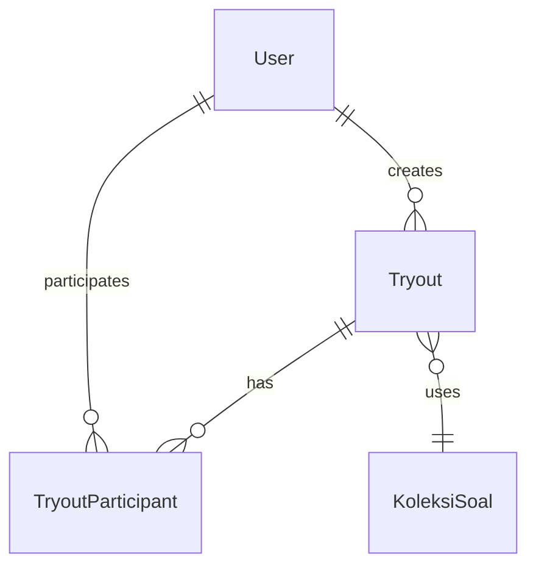
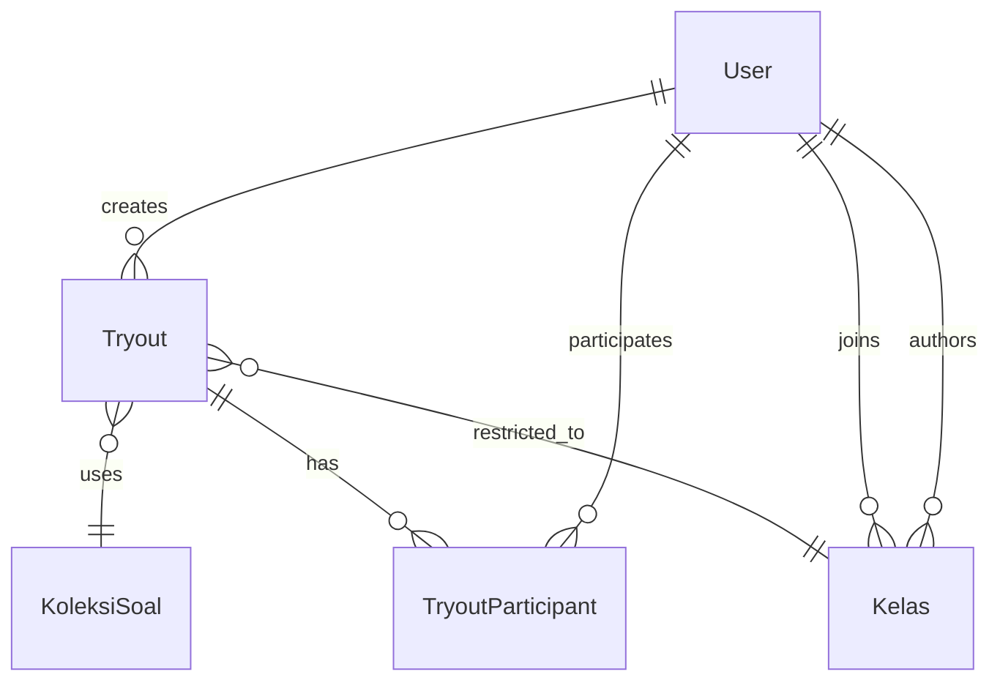
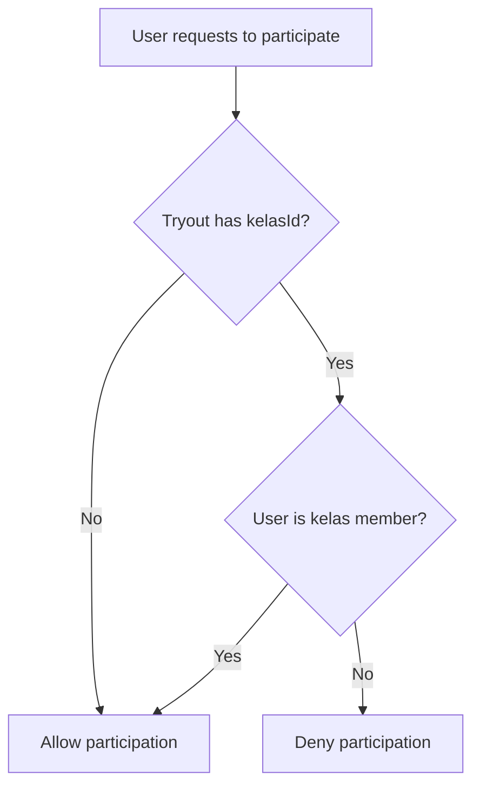

# Tryout Single Kelas Implementation Guide

## Overview

This guide provides a complete step-by-step implementation plan for **Option 1: Single Kelas per Tryout**. This approach adds a `kelasId` foreign key to the Tryout model, allowing tryouts to be either globally available or restricted to members of a specific kelas.

## Table of Contents

1. [Architecture Overview](#architecture-overview)
2. [Database Changes](#database-changes)
3. [API Route Changes](#api-route-changes)
4. [Server Action Changes](#server-action-changes)
5. [Frontend Component Changes](#frontend-component-changes)
6. [Testing Checklist](#testing-checklist)
7. [Migration Rollback](#migration-rollback)

---

## Architecture Overview

### Current State



### Target State



### Access Control Flow



---

## Database Changes

### Step 1: Update Prisma Schema

**File:** `prisma/schema.prisma`

#### 1.1 Modify the Tryout Model

Locate the `Tryout` model (around line 578) and add the `kelasId` field and relation:

```prisma
model Tryout {
  id            Int                 @id @default(autoincrement())
  nama          String
  description   String?
  startTime     DateTime
  endTime       DateTime
  duration      Int                 @default(30)
  maxAttempts   Int                 @default(1)
  shuffleQuestions Boolean          @default(false)
  passingScore  Int                 @default(60)
  koleksiSoalId Int
  isActive      Boolean             @default(false)
  guruId        String
  kelasId       Int?                // NEW: Optional kelas association
  createdAt     DateTime            @default(now())
  updatedAt     DateTime            @updatedAt
  koleksiSoal   KoleksiSoal         @relation(fields: [koleksiSoalId], references: [id], onDelete: Cascade)
  guru          User                @relation("TryoutGuru", fields: [guruId], references: [id], onDelete: Cascade)
  kelas         Kelas?              @relation("KelasTryouts", fields: [kelasId], references: [id], onDelete: SetNull)
  participants  TryoutParticipant[]

  @@index([koleksiSoalId])
  @@index([isActive])
  @@index([startTime])
  @@index([guruId])
  @@index([kelasId])  // NEW: Index for kelas filtering
}
```

#### 1.2 Modify the Kelas Model

Locate the `Kelas` model (around line 223) and add the inverse relation:

```prisma
model Kelas {
  id                Int                   @id @default(autoincrement())
  title             String
  description       String?
  jsonDescription   Json?                 @db.JsonB
  htmlDescription   String?
  type              KelasType             @default(REGULAR)
  level             Difficulty
  thumbnail         String?
  icon              String?
  isPaidClass       Boolean               @default(false)
  price             Decimal?              @db.Decimal(10, 2)
  discount          Decimal?              @db.Decimal(10, 2)
  promoCode         String?
  isDraft           Boolean               @default(true)
  createdAt         DateTime              @default(now())
  updatedAt         DateTime              @updatedAt
  authorId          String
  author            User                  @relation("KelasAuthor", fields: [authorId], references: [id], onDelete: Cascade)
  materis           Materi[]              @relation("KelasMateri")
  liveSessions      LiveSession[]         @relation("KelasLiveSessions")
  members           User[]                @relation("KelasMembers")
  vocabularySets    VocabularySet[]
  completions       UserKelasCompletion[]
  posts             Post[]                @relation("KelasPosts")
  kelasKoleksiSoals KelasKoleksiSoal[]
  tryouts           Tryout[]              @relation("KelasTryouts")  // NEW: Inverse relation

  @@index([authorId])
  @@index([type])
}
```

### Step 2: Create and Apply Migration

Run the following commands in your terminal:

```bash
# Generate migration
npx prisma migrate dev --name add_kelas_id_to_tryout

# Apply migration to database
npx prisma migrate deploy

# Regenerate Prisma Client
npx prisma generate
```

### Step 3: Verify Migration

After applying the migration, verify the changes:

```bash
# Open Prisma Studio to verify
npx prisma studio
```

Check that:
1. The `Tryout` table has a new `kelasId` column (nullable)
2. The foreign key constraint is properly set
3. The index on `kelasId` exists

---

## API Route Changes

### Step 4: Update POST Route - Create Tryout

**File:** `app/api/tryout/route.ts`

#### 4.1 Update the POST Handler

Modify the `POST` function to accept and validate `kelasId`:

```typescript
export async function POST(request: NextRequest) {
    try {
        const session = await auth.api.getSession({ headers: request.headers });
        if (!session?.user?.id) {
            return NextResponse.json({ success: false, error: 'Unauthorized' }, { status: 401 });
        }

        const body = await request.json();
        const {
            nama,
            description,
            startTime,
            endTime,
            duration,
            maxAttempts,
            shuffleQuestions,
            passingScore,
            koleksiSoalId,
            kelasId,  // NEW: Optional kelas association
            isActive = false,
        } = body;

        // Validate required fields
        if (!nama || !startTime || !endTime || !koleksiSoalId) {
            return NextResponse.json({ success: false, error: 'Missing fields' }, { status: 400 });
        }

        // Verify User Role (GURU or ADMIN)
        if (session.user.role !== 'GURU' && session.user.role !== 'ADMIN') {
            return NextResponse.json({ success: false, error: 'Forbidden' }, { status: 403 });
        }

        // Verify user owns the koleksiSoal
        const koleksi = await prisma.koleksiSoal.findUnique({
            where: { id: parseInt(koleksiSoalId) }
        });

        if (!koleksi) {
            return NextResponse.json({ success: false, error: 'Collection not found' }, { status: 404 });
        }

        if (koleksi.userId !== session.user.id) {
            return NextResponse.json({ success: false, error: 'Forbidden' }, { status: 403 });
        }

        // NEW: If kelasId is provided, verify user is the author of the kelas
        if (kelasId) {
            const kelas = await prisma.kelas.findUnique({
                where: { id: parseInt(kelasId) }
            });

            if (!kelas) {
                return NextResponse.json({ success: false, error: 'Kelas not found' }, { status: 404 });
            }

            if (kelas.authorId !== session.user.id) {
                return NextResponse.json({ 
                    success: false, 
                    error: 'You must be the author of this kelas to link it' 
                }, { status: 403 });
            }
        }

        const tryout = await prisma.tryout.create({
            data: {
                nama,
                description,
                startTime: new Date(startTime),
                endTime: new Date(endTime),
                duration: duration ? parseInt(duration) : 30,
                maxAttempts: maxAttempts ? parseInt(maxAttempts) : 1,
                shuffleQuestions: shuffleQuestions ?? false,
                passingScore: passingScore ? parseInt(passingScore) : 60,
                koleksiSoalId: parseInt(koleksiSoalId),
                isActive,
                guruId: session.user.id,
                kelasId: kelasId ? parseInt(kelasId) : null,  // NEW
            },
        });

        return NextResponse.json({
            success: true,
            data: tryout,
        }, { status: 201 });
    } catch (error) {
        console.error('Error creating tryout:', error);
        return NextResponse.json(
            { success: false, error: 'Failed to create tryout' },
            { status: 500 }
        );
    }
}
```

#### 4.2 Update the GET Handler - Filter by Kelas

Modify the `GET` function to support kelas filtering:

```typescript
export async function GET(request: NextRequest) {
    try {
        // Filters
        const searchParams = request.nextUrl.searchParams;
        const guruId = searchParams.get('guruId');
        const koleksiSoalId = searchParams.get('koleksiSoalId');
        const kelasId = searchParams.get('kelasId');  // NEW
        const isActive = searchParams.get('isActive');
        const limit = searchParams.get('limit') ? parseInt(searchParams.get('limit')!) : undefined;

        const where: any = {};
        if (guruId) where.guruId = guruId;
        if (koleksiSoalId) where.koleksiSoalId = parseInt(koleksiSoalId);
        if (kelasId) where.kelasId = parseInt(kelasId);  // NEW
        if (isActive !== null) where.isActive = isActive === 'true';

        // List tryouts
        const tryouts = await prisma.tryout.findMany({
            where,
            include: {
                guru: {
                    select: {
                        id: true,
                        name: true,
                        image: true,
                    },
                },
                kelas: {  // NEW: Include kelas info
                    select: {
                        id: true,
                        title: true,
                    },
                },
                koleksiSoal: {
                    select: {
                        id: true,
                        nama: true,
                    },
                },
                _count: {
                    select: {
                        participants: true,
                    }
                }
            },
            orderBy: { createdAt: 'desc' },
            take: limit,
        });

        return NextResponse.json({
            success: true,
            data: tryouts,
        });
    } catch (error) {
        console.error('Error fetching tryouts:', error);
        return NextResponse.json(
            { success: false, error: 'Failed to fetch tryouts' },
            { status: 500 }
        );
    }
}
```

### Step 5: Update PUT Route - Update Tryout

**File:** `app/api/tryout/[id]/route.ts`

Update the `PUT` handler to handle `kelasId`:

```typescript
export async function PUT(
    request: NextRequest,
    { params }: { params: Promise<{ id: string }> }
) {
    try {
        const { id } = await params;
        const session = await auth.api.getSession({ headers: request.headers });
        if (!session?.user?.id) {
            return NextResponse.json({ success: false, error: 'Unauthorized' }, { status: 401 });
        }

        const tryoutId = parseInt(id);
        if (isNaN(tryoutId)) {
            return NextResponse.json({ success: false, error: 'Invalid tryout id' }, { status: 400 });
        }
        
        const existingTryout = await prisma.tryout.findUnique({ 
            where: { id: tryoutId } 
        });

        if (!existingTryout) {
            return NextResponse.json({ success: false, error: 'Tryout not found' }, { status: 404 });
        }

        if (existingTryout.guruId !== session.user.id) {
            return NextResponse.json({ success: false, error: 'Forbidden' }, { status: 403 });
        }

        const body = await request.json();
        const {
            nama,
            description,
            startTime,
            endTime,
            duration,
            maxAttempts,
            shuffleQuestions,
            passingScore,
            koleksiSoalId,
            kelasId,  // NEW
            isActive,
        } = body;

        // NEW: If kelasId is provided, verify user is the author
        if (kelasId !== undefined && kelasId !== null) {
            const kelas = await prisma.kelas.findUnique({
                where: { id: parseInt(kelasId) }
            });

            if (!kelas) {
                return NextResponse.json({ success: false, error: 'Kelas not found' }, { status: 404 });
            }

            if (kelas.authorId !== session.user.id) {
                return NextResponse.json({ 
                    success: false, 
                    error: 'You must be the author of this kelas to link it' 
                }, { status: 403 });
            }
        }

        const tryout = await prisma.tryout.update({
            where: { id: tryoutId },
            data: {
                ...(nama !== undefined && { nama }),
                ...(description !== undefined && { description }),
                ...(startTime !== undefined && { startTime: new Date(startTime) }),
                ...(endTime !== undefined && { endTime: new Date(endTime) }),
                ...(duration !== undefined && { duration: parseInt(duration) }),
                ...(maxAttempts !== undefined && { maxAttempts: parseInt(maxAttempts) }),
                ...(shuffleQuestions !== undefined && { shuffleQuestions }),
                ...(passingScore !== undefined && { passingScore: parseInt(passingScore) }),
                ...(koleksiSoalId !== undefined && { koleksiSoalId: parseInt(koleksiSoalId) }),
                ...(kelasId !== undefined && { kelasId: kelasId ? parseInt(kelasId) : null }),  // NEW
                ...(isActive !== undefined && { isActive }),
            },
        });

        return NextResponse.json({
            success: true,
            data: tryout,
        });
    } catch (error) {
        console.error('Error updating tryout:', error);
        return NextResponse.json(
            { success: false, error: 'Failed to update tryout' },
            { status: 500 }
        );
    }
}
```

### Step 6: Update GET Route - Include Kelas Info

**File:** `app/api/tryout/[id]/route.ts`

Update the `GET` handler to include kelas information:

```typescript
export async function GET(
    request: NextRequest,
    { params }: { params: Promise<{ id: string }> }
) {
    try {
        const { id } = await params;
        
        const parsedId = parseInt(id);
        if (isNaN(parsedId)) {
            return NextResponse.json({ success: false, error: 'Invalid tryout id' }, { status: 400 });
        }

        const tryout = await prisma.tryout.findUnique({
            where: { id: parsedId },
            include: {
                guru: {
                    select: {
                        id: true,
                        name: true,
                        image: true,
                    },
                },
                kelas: {  // NEW: Include kelas info
                    select: {
                        id: true,
                        title: true,
                    },
                },
                koleksiSoal: {
                    include: {
                        soals: {
                            include: {
                                opsis: {
                                    orderBy: { order: 'asc' }
                                },
                                attachments: true,
                            },
                            orderBy: { order: 'asc' }
                        }
                    }
                },
            },
        });

        if (!tryout) {
            return NextResponse.json({ success: false, error: 'Tryout not found' }, { status: 404 });
        }

        return NextResponse.json({
            success: true,
            data: tryout,
        });
    } catch (error) {
        console.error('Error fetching tryout:', error);
        return NextResponse.json(
            { success: false, error: 'Failed to fetch tryout' },
            { status: 500 }
        );
    }
}
```

### Step 7: Update Participate Route - Add Access Control

**File:** `app/api/tryout/[id]/participate/route.ts`

Add kelas membership validation:

```typescript
export async function POST(
    request: NextRequest,
    { params }: { params: Promise<{ id: string }> }
) {
    try {
        const { id } = await params;
        const session = await auth.api.getSession({ headers: request.headers });
        if (!session?.user?.id) {
            return NextResponse.json({ success: false, error: 'Unauthorized' }, { status: 401 });
        }

        const tryoutId = parseInt(id);
        if (isNaN(tryoutId)) {
            return NextResponse.json({ success: false, error: 'Invalid tryout id' }, { status: 400 });
        }

        // Fetch tryout with kelas info
        const tryout = await prisma.tryout.findUnique({
            where: { id: tryoutId },
            include: {
                kelas: true  // NEW: Include kelas for access control
            }
        });

        if (!tryout) {
            return NextResponse.json({ success: false, error: 'Tryout not found' }, { status: 404 });
        }

        // Check if tryout is active
        if (!tryout.isActive) {
            return NextResponse.json({ success: false, error: 'Tryout is not active' }, { status: 400 });
        }

        // Check if tryout is within time window
        const now = new Date();
        if (now < tryout.startTime) {
            return NextResponse.json({ success: false, error: 'Tryout has not started yet' }, { status: 400 });
        }

        if (now > tryout.endTime) {
            return NextResponse.json({ success: false, error: 'Tryout has ended' }, { status: 400 });
        }

        // NEW: If tryout is linked to a kelas, verify user is a member
        if (tryout.kelasId) {
            const isMember = await prisma.kelas.findUnique({
                where: {
                    id: tryout.kelasId,
                    members: {
                        some: { id: session.user.id }
                    }
                }
            });

            if (!isMember) {
                return NextResponse.json({ 
                    success: false, 
                    error: 'You must be a member of this kelas to participate in this tryout' 
                }, { status: 403 });
            }
        }

        // Check if user already participated
        const existing = await prisma.tryoutParticipant.findUnique({
            where: {
                tryoutId_userId: {
                    tryoutId,
                    userId: session.user.id,
                }
            }
        });

        if (existing) {
            // Check if user can retry (if maxAttempts > 1 and not exceeded)
            if (existing.status === 'SUBMITTED' && existing.attemptCount < tryout.maxAttempts) {
                // Allow retry - update attempt count and reset status
                const updatedParticipant = await prisma.tryoutParticipant.update({
                    where: { id: existing.id },
                    data: {
                        status: 'IN_PROGRESS',
                        startedAt: new Date(),
                        attemptCount: existing.attemptCount + 1,
                        score: 0,
                        submittedAt: null,
                        timeTakenSeconds: null,
                    },
                });
                // Delete old answers for retry
                await prisma.tryoutAnswer.deleteMany({
                    where: { participantId: existing.id },
                });
                return NextResponse.json({ success: true, data: updatedParticipant });
            }

            // Return existing if no retry allowed
            return NextResponse.json({ success: true, data: existing });
        }

        const participant = await prisma.tryoutParticipant.create({
            data: {
                tryoutId,
                userId: session.user.id,
                status: 'IN_PROGRESS',
                startedAt: new Date(),
                attemptCount: 1,
            },
        });

        return NextResponse.json({
            success: true,
            data: participant,
        });
    } catch (error) {
        console.error('Error participating in tryout:', error);
        return NextResponse.json(
            { success: false, error: 'Failed to join tryout' },
            { status: 500 }
        );
    }
}
```

---

## Server Action Changes

### Step 8: Update Tryout Schema

**File:** `app/actions/kelas/tryout.ts`

Update the `tryoutSchema` to include `kelasId`:

```typescript
const tryoutSchema = z.object({
  nama: z.string().min(1).max(255),
  description: z.string().optional(),
  startTime: z.string().datetime(),
  endTime: z.string().datetime(),
  duration: z.number().int().min(1).default(30),
  maxAttempts: z.number().int().min(1).default(1),
  shuffleQuestions: z.boolean().default(false),
  passingScore: z.number().int().min(0).max(100).default(60),
  koleksiSoalId: z.number().int().positive(),
  kelasId: z.number().int().positive().optional(),  // NEW: Optional kelas
  isActive: z.boolean().default(false),
});
```

### Step 9: Update saveTryout Function

**File:** `app/actions/kelas/tryout.ts`

Update the `saveTryout` function to handle kelas association:

```typescript
export async function saveTryout(tryoutData: z.infer<typeof tryoutSchema>, tryoutId?: number) {
  try {
    const session = await assertAuthenticated();
    const valid = tryoutSchema.parse(tryoutData);

    // Verify user owns the koleksiSoal
    const koleksi = await prisma.koleksiSoal.findUnique({
      where: { id: valid.koleksiSoalId },
      select: { userId: true }
    });

    if (!koleksi) {
      return { success: false, error: 'Question collection not found' };
    }

    if (koleksi.userId !== session.user.id) {
      return { success: false, error: 'Not authorized to use this question collection' };
    }

    // NEW: If kelasId is provided, verify user is the author
    if (valid.kelasId) {
      const kelas = await prisma.kelas.findUnique({
        where: { id: valid.kelasId },
        select: { authorId: true }
      });

      if (!kelas) {
        return { success: false, error: 'Kelas not found' };
      }

      if (kelas.authorId !== session.user.id) {
        return { success: false, error: 'Not authorized to link to this kelas' };
      }
    }

    let tryout;
    if (tryoutId) {
      // Update existing tryout
      const existingTryout = await prisma.tryout.findUnique({
        where: { id: tryoutId },
        select: { guruId: true }
      });

      if (!existingTryout) {
        return { success: false, error: 'Tryout not found' };
      }

      if (existingTryout.guruId !== session.user.id) {
        return { success: false, error: 'Not authorized to update this tryout' };
      }

      tryout = await prisma.tryout.update({
        where: { id: tryoutId },
        data: {
          nama: valid.nama,
          description: valid.description,
          startTime: new Date(valid.startTime),
          endTime: new Date(valid.endTime),
          duration: valid.duration,
          maxAttempts: valid.maxAttempts,
          shuffleQuestions: valid.shuffleQuestions,
          passingScore: valid.passingScore,
          koleksiSoalId: valid.koleksiSoalId,
          kelasId: valid.kelasId,  // NEW
          isActive: valid.isActive,
        },
      });
    } else {
      // Create new tryout
      tryout = await prisma.tryout.create({
        data: {
          nama: valid.nama,
          description: valid.description,
          startTime: new Date(valid.startTime),
          endTime: new Date(valid.endTime),
          duration: valid.duration,
          maxAttempts: valid.maxAttempts,
          shuffleQuestions: valid.shuffleQuestions,
          passingScore: valid.passingScore,
          koleksiSoalId: valid.koleksiSoalId,
          kelasId: valid.kelasId,  // NEW
          isActive: valid.isActive,
          guruId: session.user.id,
        },
      });
    }

    // Fetch the tryout with relations to return
    const finalTryout = await prisma.tryout.findUnique({
      where: { id: tryout.id },
      include: {
        kelas: {  // NEW: Include kelas info
          select: {
            id: true,
            title: true,
          },
        },
        koleksiSoal: {
          select: {
            id: true,
            nama: true,
          },
        },
        guru: {
          select: {
            id: true,
            name: true,
          },
        },
        _count: {
          select: {
            participants: true,
          },
        },
      },
    });

    return { success: true, data: finalTryout };
  } catch (error) {
    console.error("Save tryout error:", error);
    if (error instanceof z.ZodError) {
      return { success: false, error: error.issues[0].message };
    }
    return { success: false, error: "Failed to save tryout" };
  }
}
```

### Step 10: Add New Server Action for Guru Kelas

**File:** `app/actions/kelas/tryout.ts`

Add a new function to fetch guru's kelas for the dropdown:

```typescript
export async function getGuruKelas() {
  try {
    const session = await assertAuthenticated();

    // This function is GURU-only
    if (session.user.role !== "GURU") {
      return { success: false, error: "Not authorized" };
    }

    const userId = session.user.id;

    // Get kelas authored by the guru
    const kelasList = await prisma.kelas.findMany({
      where: {
        authorId: userId,
      },
      select: {
        id: true,
        title: true,
        type: true,
        level: true,
        _count: {
          select: {
            members: true,
          },
        },
      },
      orderBy: { createdAt: 'desc' }
    });

    return { success: true, data: kelasList };
  } catch (error) {
    console.error("Get guru kelas error:", error);
    return { success: false, error: "Failed to get kelas" };
  }
}
```

### Step 11: Add Server Action for Tryouts by Kelas

**File:** `app/actions/kelas/tryout.ts`

Add a new function to fetch tryouts for a specific kelas:

```typescript
export async function getTryoutsByKelas(kelasId: number) {
  try {
    const session = await assertAuthenticated();

    // Verify user is a member of the kelas or is the author
    const kelas = await prisma.kelas.findUnique({
      where: { id: kelasId },
      select: { 
        authorId: true,
        members: {
          where: { id: session.user.id },
          select: { id: true }
        }
      }
    });

    if (!kelas) {
      return { success: false, error: "Kelas not found" };
    }

    if (kelas.authorId !== session.user.id && kelas.members.length === 0) {
      return { success: false, error: "Not authorized" };
    }

    // Get tryouts for this kelas
    const tryouts = await prisma.tryout.findMany({
      where: {
        kelasId: kelasId,
      },
      include: {
        koleksiSoal: {
          select: {
            id: true,
            nama: true,
          },
        },
        guru: {
          select: {
            id: true,
            name: true,
          },
        },
        _count: {
          select: {
            participants: true,
          },
        },
      },
      orderBy: { createdAt: 'desc' }
    });

    return { success: true, data: tryouts };
  } catch (error) {
    console.error("Get tryouts by kelas error:", error);
    return { success: false, error: "Failed to get tryouts" };
  }
}
```

---

## Frontend Component Changes

### Step 12: Update TryoutSheet Component

**File:** `components/dashboard/tryout-sheet.tsx`

#### 12.1 Add Kelas State and Types

```typescript
"use client";

import { useEffect, useState } from "react";
import { Sheet, SheetContent, SheetHeader, SheetTitle } from "@/components/ui/sheet";
import { Input } from "@/components/ui/input";
import { Label } from "@/components/ui/label";
import { Textarea } from "@/components/ui/textarea";
import { Switch } from "@/components/ui/switch";
import { Button } from "@/components/ui/button";
import { Select, SelectContent, SelectItem, SelectTrigger, SelectValue } from "@/components/ui/select";
import { DateTimePicker } from "@/components/ui/datetime-picker";
import { saveTryout, getGuruSoalSetsForTryout, getGuruKelas } from "@/app/actions/kelas/tryout";
import { Tryout } from "./tryout-card";
import { Loader2, Save, X } from "lucide-react";
import { toast } from "sonner";

interface SoalSetOption {
  id: number;
  nama: string;
  _count: {
    soals: number;
  };
}

// NEW: Kelas option type
interface KelasOption {
  id: number;
  title: string;
  type: string;
  level: string;
  _count: {
    members: number;
  };
}

interface TryoutSheetProps {
  isOpen: boolean;
  onOpenChange: (open: boolean) => void;
  tryout?: Tryout | null;
  onSuccess: () => void;
  onCancel: () => void;
}
```

#### 12.2 Update Form State

```typescript
export function TryoutSheet({ isOpen, onOpenChange, tryout, onSuccess, onCancel }: TryoutSheetProps) {
  const [saving, setSaving] = useState(false);
  const [soalSets, setSoalSets] = useState<SoalSetOption[]>([]);
  const [kelasList, setKelasList] = useState<KelasOption[]>([]);  // NEW
  const [loadingSoalSets, setLoadingSoalSets] = useState(false);
  const [loadingKelas, setLoadingKelas] = useState(false);  // NEW
  const [formData, setFormData] = useState({
    nama: "",
    description: "",
    startTime: "",
    endTime: "",
    duration: 30,
    maxAttempts: 1,
    shuffleQuestions: false,
    passingScore: 60,
    koleksiSoalId: "",
    kelasId: "",  // NEW
    isActive: false,
  });
```

#### 12.3 Update useEffect to Fetch Kelas

```typescript
  useEffect(() => {
    if (isOpen) {
      fetchSoalSets();
      fetchKelas();  // NEW
    }
  }, [isOpen]);

  // NEW: Fetch guru's kelas
  const fetchKelas = async () => {
    setLoadingKelas(true);
    try {
      const result = await getGuruKelas();
      if (result.success && result.data) {
        setKelasList(result.data);
      }
    } catch (error) {
      console.error("Failed to fetch kelas:", error);
    } finally {
      setLoadingKelas(false);
    }
  };

  const fetchSoalSets = async () => {
    setLoadingSoalSets(true);
    try {
      const result = await getGuruSoalSetsForTryout();
      if (result.success && result.data) {
        setSoalSets(result.data);
      }
    } catch (error) {
      console.error("Failed to fetch soal sets:", error);
    } finally {
      setLoadingSoalSets(false);
    }
  };
```

#### 12.4 Update useEffect for Tryout Data

```typescript
  useEffect(() => {
    if (tryout) {
      setFormData({
        nama: tryout.nama,
        description: tryout.description || "",
        startTime: new Date(tryout.startTime).toISOString(),
        endTime: new Date(tryout.endTime).toISOString(),
        duration: tryout.duration,
        maxAttempts: tryout.maxAttempts,
        shuffleQuestions: tryout.shuffleQuestions,
        passingScore: tryout.passingScore,
        koleksiSoalId: tryout.koleksiSoalId.toString(),
        kelasId: tryout.kelasId?.toString() || "",  // NEW
        isActive: tryout.isActive,
      });
    } else {
      setFormData({
        nama: "",
        description: "",
        startTime: "",
        endTime: "",
        duration: 30,
        maxAttempts: 1,
        shuffleQuestions: false,
        passingScore: 60,
        koleksiSoalId: "",
        kelasId: "",  // NEW
        isActive: false,
      });
    }
  }, [tryout, isOpen]);
```

#### 12.5 Update handleSubmit

```typescript
  const handleSubmit = async (e: React.FormEvent) => {
    e.preventDefault();
    setSaving(true);

    try {
      const result = await saveTryout(
        {
          nama: formData.nama,
          description: formData.description || undefined,
          startTime: formData.startTime,
          endTime: formData.endTime,
          duration: formData.duration,
          maxAttempts: formData.maxAttempts,
          shuffleQuestions: formData.shuffleQuestions,
          passingScore: formData.passingScore,
          koleksiSoalId: parseInt(formData.koleksiSoalId),
          kelasId: formData.kelasId ? parseInt(formData.kelasId) : undefined,  // NEW
          isActive: formData.isActive,
        },
        tryout?.id
      );

      if (result.success) {
        toast.success(tryout ? "Tryout berhasil diperbarui" : "Tryout berhasil dibuat");
        onOpenChange(false);
        onSuccess();
      } else {
        toast.error(result.error || "Gagal menyimpan tryout");
      }
    } catch (error) {
      console.error("Failed to save tryout:", error);
      toast.error("Gagal menyimpan tryout");
    } finally {
      setSaving(false);
    }
  };
```

#### 12.6 Add Kelas Selector to Form

Add this section after the koleksiSoalId selector:

```tsx
        <div className="p-6">
          <form onSubmit={handleSubmit} className="space-y-4">
            {/* Nama */}
            <div className="space-y-2">
              <Label htmlFor="nama">Nama Tryout</Label>
              <Input
                id="nama"
                value={formData.nama}
                onChange={(e) => setFormData({ ...formData, nama: e.target.value })}
                placeholder="Contoh: Ujian Matematika Kelas 10"
                required
              />
            </div>

            {/* Description */}
            <div className="space-y-2">
              <Label htmlFor="description">Deskripsi</Label>
              <Textarea
                id="description"
                value={formData.description}
                onChange={(e) => setFormData({ ...formData, description: e.target.value })}
                placeholder="Deskripsi singkat tentang tryout..."
                rows={3}
              />
            </div>

            {/* Koleksi Soal */}
            <div className="space-y-2">
              <Label htmlFor="koleksiSoalId">Koleksi Soal</Label>
              {loadingSoalSets ? (
                <div className="flex items-center justify-center p-4">
                  <Loader2 className="h-4 w-4 animate-spin" />
                </div>
              ) : (
                <Select
                  value={formData.koleksiSoalId}
                  onValueChange={(value) => setFormData({ ...formData, koleksiSoalId: value })}
                >
                  <SelectTrigger>
                    <SelectValue placeholder="Pilih koleksi soal" />
                  </SelectTrigger>
                  <SelectContent>
                    {soalSets.map((set) => (
                      <SelectItem key={set.id} value={set.id.toString()}>
                        {set.nama} ({set._count.soals} soal)
                      </SelectItem>
                    ))}
                  </SelectContent>
                </Select>
              )}
            </div>

            {/* NEW: Kelas Selection */}
            <div className="space-y-2">
              <Label htmlFor="kelasId">Kelas (Opsional)</Label>
              {loadingKelas ? (
                <div className="flex items-center justify-center p-4">
                  <Loader2 className="h-4 w-4 animate-spin" />
                </div>
              ) : (
                <Select
                  value={formData.kelasId}
                  onValueChange={(value) => setFormData({ ...formData, kelasId: value })}
                >
                  <SelectTrigger>
                    <SelectValue placeholder="Pilih kelas (opsional)" />
                  </SelectTrigger>
                  <SelectContent>
                    <SelectItem value="">Global (semua user)</SelectItem>
                    {kelasList.map((kelas) => (
                      <SelectItem key={kelas.id} value={kelas.id.toString()}>
                        {kelas.title} ({kelas._count.members} member)
                      </SelectItem>
                    ))}
                  </SelectContent>
                </Select>
              )}
              <p className="text-xs text-muted-foreground">
                Jika dipilih, hanya anggota kelas yang dapat mengikuti tryout ini.
                Kosongkan agar tryout dapat diakses oleh semua user.
              </p>
            </div>

            {/* Start Time */}
            <div className="space-y-2">
              <Label htmlFor="startTime">Waktu Mulai</Label>
              <DateTimePicker
                value={formData.startTime}
                onChange={(value) => setFormData({ ...formData, startTime: value })}
              />
            </div>

            {/* End Time */}
            <div className="space-y-2">
              <Label htmlFor="endTime">Waktu Selesai</Label>
              <DateTimePicker
                value={formData.endTime}
                onChange={(value) => setFormData({ ...formData, endTime: value })}
              />
            </div>

            {/* Duration */}
            <div className="space-y-2">
              <Label htmlFor="duration">Durasi (menit)</Label>
              <Input
                id="duration"
                type="number"
                min="1"
                value={formData.duration}
                onChange={(e) => setFormData({ ...formData, duration: parseInt(e.target.value) || 30 })}
              />
            </div>

            {/* Max Attempts */}
            <div className="space-y-2">
              <Label htmlFor="maxAttempts">Maksimal Percobaan</Label>
              <Input
                id="maxAttempts"
                type="number"
                min="1"
                value={formData.maxAttempts}
                onChange={(e) => setFormData({ ...formData, maxAttempts: parseInt(e.target.value) || 1 })}
              />
            </div>

            {/* Passing Score */}
            <div className="space-y-2">
              <Label htmlFor="passingScore">Nilai Minimum Lulus (0-100)</Label>
              <Input
                id="passingScore"
                type="number"
                min="0"
                max="100"
                value={formData.passingScore}
                onChange={(e) => setFormData({ ...formData, passingScore: parseInt(e.target.value) || 60 })}
              />
            </div>

            {/* Shuffle Questions */}
            <div className="flex items-center justify-between">
              <Label htmlFor="shuffleQuestions">Acak Urutan Soal</Label>
              <Switch
                id="shuffleQuestions"
                checked={formData.shuffleQuestions}
                onCheckedChange={(checked) => setFormData({ ...formData, shuffleQuestions: checked })}
              />
            </div>

            {/* Is Active */}
            <div className="flex items-center justify-between">
              <Label htmlFor="isActive">Aktif</Label>
              <Switch
                id="isActive"
                checked={formData.isActive}
                onCheckedChange={(checked) => setFormData({ ...formData, isActive: checked })}
              />
              <p className="text-xs text-muted-foreground">
                Tryout harus aktif agar siswa dapat mengikuti
              </p>
            </div>

            {/* Actions */}
            <div className="flex gap-2 pt-4">
              <Button
                type="button"
                variant="outline"
                onClick={handleCancel}
                disabled={saving}
                className="flex-1"
              >
                <X className="h-4 w-4 mr-2" />
                Batal
              </Button>
              <Button type="submit" disabled={saving} className="flex-1">
                {saving ? (
                  <>
                    <Loader2 className="h-4 w-4 mr-2 animate-spin" />
                    Menyimpan...
                  </>
                ) : (
                  <>
                    <Save className="h-4 w-4 mr-2" />
                    Simpan
                  </>
                )}
              </Button>
            </div>
          </form>
        </div>
```

### Step 13: Update TryoutCard Component

**File:** `components/dashboard/tryout-card.tsx`

Update the card to display kelas information:

```typescript
// Add kelas to the Tryout interface
export interface Tryout {
  id: number;
  nama: string;
  description: string | null;
  startTime: string;
  endTime: string;
  duration: number;
  maxAttempts: number;
  shuffleQuestions: boolean;
  passingScore: number;
  koleksiSoalId: number;
  kelasId: number | null;  // NEW
  isActive: boolean;
  guruId: string;
  createdAt: string;
  updatedAt: string;
  guru?: {
    id: string;
    name: string | null;
    image: string | null;
  };
  kelas?: {  // NEW
    id: number;
    title: string;
  };
  koleksiSoal?: {
    id: number;
    nama: string;
  };
  _count?: {
    participants: number;
  };
}

// In the component JSX, add kelas badge
<div className="flex items-center gap-2 flex-wrap">
  {tryout.kelas && (
    <Badge variant="secondary">
      {tryout.kelas.title}
    </Badge>
  )}
  <Badge variant={tryout.isActive ? "default" : "secondary"}>
    {tryout.isActive ? "Aktif" : "Tidak Aktif"}
  </Badge>
</div>
```

### Step 14: Update ManageTryout Component

**File:** `components/dashboard/manage-tryout.tsx`

Add kelas filtering capability:

```typescript
// Add kelas filter state
const [selectedKelas, setSelectedKelas] = useState<string>("");

// Add kelas filter dropdown
<div className="flex gap-2 mb-4">
  <Select value={selectedKelas} onValueChange={setSelectedKelas}>
    <SelectTrigger className="w-[200px]">
      <SelectValue placeholder="Filter by Kelas" />
    </SelectTrigger>
    <SelectContent>
      <SelectItem value="all">All Tryouts</SelectItem>
      {kelasList.map((kelas) => (
        <SelectItem key={kelas.id} value={kelas.id.toString()}>
          {kelas.title}
        </SelectItem>
      ))}
    </SelectContent>
  </Select>
</div>

// Update fetchTryouts to include kelas filter
const fetchTryouts = async () => {
  setLoading(true);
  try {
    const params = new URLSearchParams();
    if (selectedKelas && selectedKelas !== "all") {
      params.append("kelasId", selectedKelas);
    }
    
    const response = await fetch(`/api/tryout?${params.toString()}`);
    const result = await response.json();
    if (result.success) {
      setTryouts(result.data);
    }
  } catch (error) {
    console.error("Failed to fetch tryouts:", error);
  } finally {
    setLoading(false);
  }
};
```

---

## Testing Checklist

### Database Migration Testing

- [ ] Migration runs successfully without errors
- [ ] `kelasId` column exists in Tryout table (nullable)
- [ ] Foreign key constraint is properly set
- [ ] Index on `kelasId` exists
- [ ] Existing tryouts have `kelasId` set to NULL

### API Testing

#### POST /api/tryout
- [ ] Can create tryout without kelasId (global tryout)
- [ ] Can create tryout with valid kelasId
- [ ] Cannot create tryout with invalid kelasId (404 error)
- [ ] Cannot create tryout with kelasId owned by another user (403 error)
- [ ] Cannot create tryout without required fields

#### GET /api/tryout
- [ ] Returns all tryouts when no filters applied
- [ ] Filters tryouts by kelasId correctly
- [ ] Includes kelas information in response
- [ ] Returns empty array for non-existent kelasId

#### GET /api/tryout/[id]
- [ ] Returns tryout with kelas information
- [ ] Returns null kelas for global tryouts

#### PUT /api/tryout/[id]
- [ ] Can update tryout kelasId to valid value
- [ ] Can update tryout kelasId to null (make global)
- [ ] Cannot update to invalid kelasId (404 error)
- [ ] Cannot update to kelasId owned by another user (403 error)

#### POST /api/tryout/[id]/participate
- [ ] User can participate in global tryout (kelasId = null)
- [ ] User can participate in tryout if they are kelas member
- [ ] User cannot participate if not kelas member (403 error)
- [ ] Existing participation logic still works

### Server Action Testing

- [ ] `saveTryout` works with and without kelasId
- [ ] `saveTryout` validates kelas ownership
- [ ] `getGuruKelas` returns correct kelas list
- [ ] `getTryoutsByKelas` returns correct tryouts
- [ ] `getGuruTryouts` includes kelas information

### Frontend Testing

- [ ] TryoutSheet loads kelas dropdown
- [ ] Can select kelas from dropdown
- [ ] Can leave kelas unselected (global option)
- [ ] Form submits correctly with/without kelas
- [ ] TryoutCard displays kelas badge when applicable
- [ ] ManageTryout can filter by kelas
- [ ] Error messages display correctly

### Access Control Testing

- [ ] Non-kelas member cannot access restricted tryout
- [ ] Kelas member can access restricted tryout
- [ ] Guru can link tryout to their own kelas
- [ ] Guru cannot link tryout to others' kelas

---

## Migration Rollback

If you need to rollback this migration:

```bash
# Rollback the migration
npx prisma migrate resolve --rolled-back add_kelas_id_to_tryout

# Or manually revert the schema and create a new migration
```

To manually revert:

1. Remove `kelasId` field from Tryout model
2. Remove `kelas` relation from Tryout model
3. Remove `tryouts` relation from Kelas model
4. Remove `@@index([kelasId])` from Tryout model
5. Run: `npx prisma migrate dev --name remove_kelas_id_from_tryout`

---

## Summary

This implementation adds kelas-specific access control to tryouts by:

1. **Adding a nullable `kelasId` foreign key** to the Tryout model
2. **Updating API routes** to accept, validate, and filter by kelasId
3. **Adding access control** in the participate endpoint
4. **Updating server actions** to handle kelas association
5. **Enhancing the UI** with kelas selection and filtering

The approach maintains backward compatibility by making `kelasId` optional, allowing tryouts to remain globally accessible when no kelas is specified.
